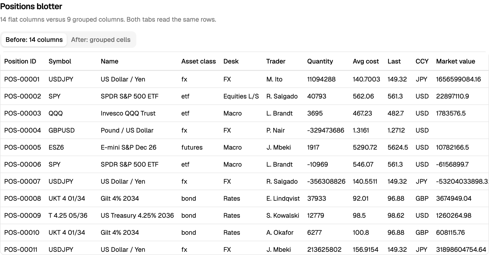
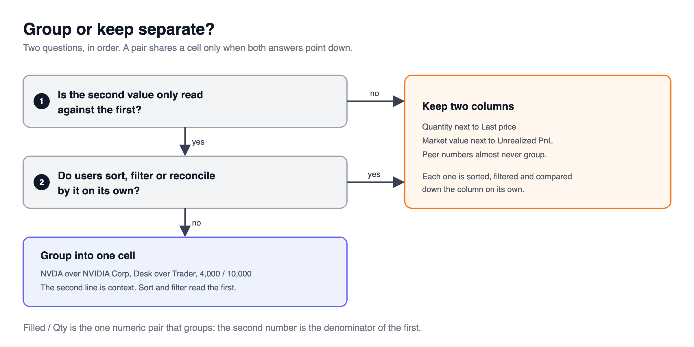
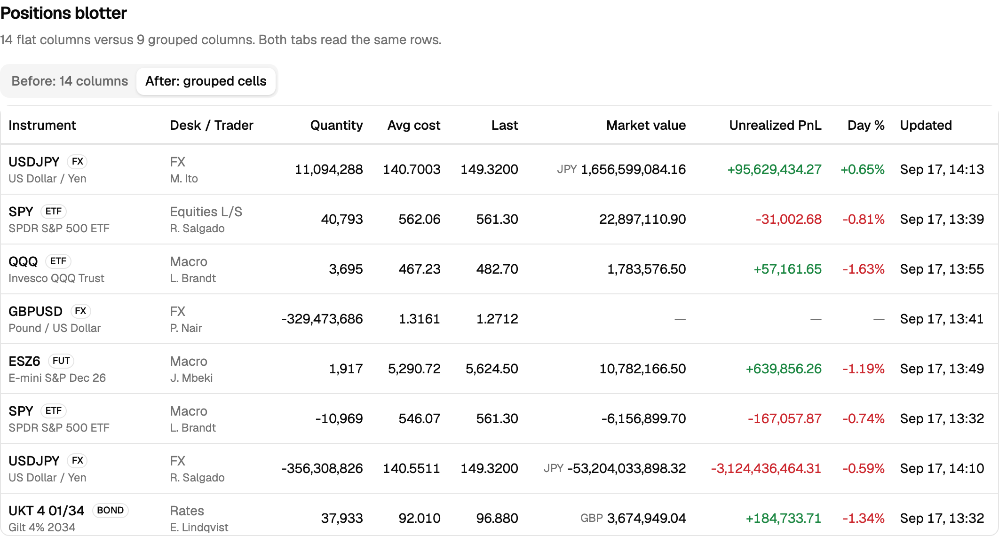
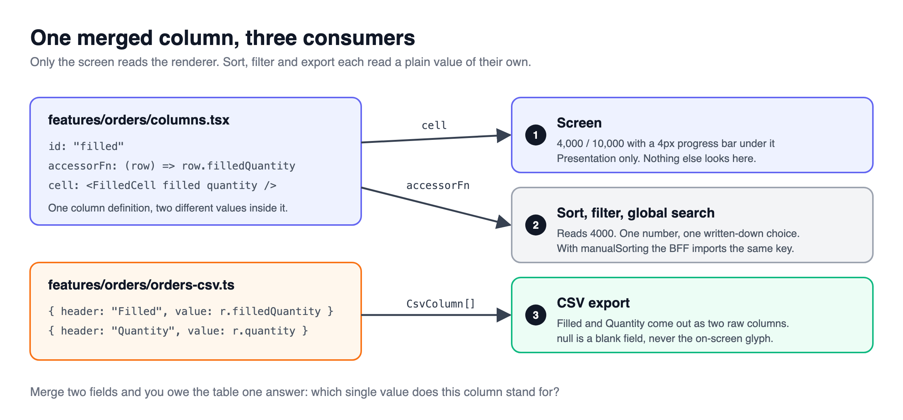

> [!TERMS]
>
> - **Cell** - one box in the table: one row, one column.
> - **Grouping** - showing two fields in one cell, one on top of the other.
> - **Accessor** - the function that reads the raw value a column stands for. Sorting and filtering use this, not what you draw.
> - **Renderer** - the function that draws the cell. It is only for the eyes.
> - **Reconcile** - checking figures line by line against another system, like a bank statement.

## The big picture

> [!TLDR]
> Tables age badly when every field gets its own column.
> Put context in the same cell as the value it explains, and keep numbers people compare apart.

Table: each row is a cell design decision and the rule this article recommends for it.

| Decision                   | The rule                                                                             |
| -------------------------- | ------------------------------------------------------------------------------------ |
| Put two fields in one cell | Only if the second is read _with_ the first, and nobody sorts or filters by it alone |
| Keep apart                 | Numbers people compare: quantity and price, value and profit                         |
| What sorting uses          | The accessor, never the drawn cell                                                   |

Every column costs width and one more stop for the eye on every row.
Once a table scrolls sideways, the name of the thing you are looking at slides off-screen while you read its numbers.



> [!ANALOGY]
> A grouped cell is a name badge: big name, small job title underneath.
> You read the name; the title just tells you which Sam this is.

> [!RECAP]
>
> - Every column costs width and attention.
> - Group context with its value; keep numbers people compare apart.

## When two fields share a cell

> [!TLDR]
> Group two fields when the second one only makes sense next to the first.
> Nobody scans a column for "NVIDIA Corp". They scan for `NVDA`, and the name underneath just confirms it.



> [!STEPS]
>
> 1. **Instrument.** The symbol on top; the full name and asset type small and grey below it.
> 2. **Filled / Qty.** "1,200 of 5,000 filled" is really one fact (a ratio), shown with a thin progress bar.
> 3. **Desk / Trader.** Who owns the row. Both lines grey, so they never compete with the numbers.
> 4. **Submitted.** A time, plus a small "3h" age label worked out from that same time, so they can never disagree.



> [!NUANCE]-
>
> - Warning icons go on the small second line, so the main column stays easy to scan.
> - Work out "3h ago" from a timestamp the server sends, never from the clock while drawing. Otherwise the server's HTML and the browser's differ.
> - The day someone asks to sort by trader, trader gets its own column back.

> [!WIN]-
> Fourteen columns became nine, and the table fits on screen without scrolling sideways.

> [!RECAP]
>
> - Share a cell when the second field only makes sense next to the first.
> - Make the second line small and grey so it never competes.
> - Give it its own column back the day someone sorts by it.

## When NOT to share a cell

> [!TLDR]
> Text context groups well.
> Numbers that people compare almost never do.

A "Qty @ Price" cell looks tidy.
It fails three ways at once.

Table: each row is one job a column does, and why a "Qty @ Price" cell cannot do it.

| Job                     | Why the merged cell fails                                                            |
| ----------------------- | ------------------------------------------------------------------------------------ |
| Sorting                 | A risk manager sorts by quantity; a trader sorts by price. One column sorts one way. |
| Filtering               | "Quantity below zero" and "price below 5" cannot both live on one column.            |
| Comparing down the page | People compare digit under digit. Two stacked numbers break that.                    |

> [!NUANCE]-
>
> - Market value and profit are checked (reconciled) against _different_ reports, so they stay neighbours, not a pair.
> - "Filled / Qty" is the one exception, because the second number is the bottom of the first number's fraction.

> [!INTERVIEW]-
>
> - _How should a grouped header be labelled?_ Name both halves, in the same order and with the same separator as the cell: "Filled / Qty". Add a tooltip saying which half the sort uses.

> [!RECAP]
>
> - Numbers people sort, filter or compare need their own columns.
> - Filled / Qty is the exception because it is really one fraction.

## Sorting ignores what you draw

> [!TLDR]
> TanStack never looks at your drawn cell when it sorts or filters.
> So when you merge two fields, you must pick one value for the column to sort by - and write down why.



> [!THINK]
> The Filled / Qty cell shows two numbers.
> Which one should the column sort by: the filled amount, or the percentage filled?
> Where would you record that choice so the next person does not "fix" it?

```tsx title="filled-column.tsx"
export const filledColumn: ColumnDef<OrderRow> = {
  id: "filledQuantity",
  // Sorts by the filled amount, not the fill percentage:
  // "who has the most done" is the question this table answers.
  accessorFn: (row) => row.filledQuantity,
  cell: ({ row }) => (
    <FilledCell
      filled={row.original.filledQuantity}
      quantity={row.original.quantity}
    />
  ),
};
```

> [!GOTCHA]
> The comment is the point.
> When someone reports "this column sorts wrong", it tells them it was a choice, not a bug.

> [!NUANCE]-
>
> - The CSV export splits every merged cell back into separate columns and writes plain numbers, because a spreadsheet cannot add up "EUR -879,400.00".
> - An empty cell on screen becomes a truly blank field in the CSV.

> [!RECAP]
>
> - Sorting and filtering read the accessor, never the drawn cell.
> - Pick one sort value for a merged column and write down why.
> - The CSV splits merged cells back apart and writes plain numbers.

## Summary

> [!SUMMARY]
>
> - Every column costs width and attention, so group context with the value it explains.
> - Group a field only when it is read with another and never sorted or filtered alone.
> - Keep numbers people compare in their own columns.
> - Sort, filter and export read the raw value; the drawn cell is only for the eyes.

```quiz
[
  {
    "q": "A PM asks to merge Quantity and Last price into one 'Qty @ Price' cell to save width. Strongest objection?",
    "options": [
      "Two-line cells break virtualization estimates",
      "Price must always show a currency code",
      "They are peer numbers sorted and filtered independently",
      "Merged cells cannot be exported to CSV"
    ],
    "answer": 2,
    "expl": "One column has one sort key and one filter, and a stack breaks digit-under-digit comparison. Export can re-split merged cells, so that is not the blocker."
  },
  {
    "q": "Which pair is a good candidate for one cell?",
    "options": [
      "Symbol with the instrument name beneath it",
      "Market value and unrealized PnL",
      "Quantity and average cost",
      "Day change percent and portfolio weight"
    ],
    "answer": 0,
    "expl": "The name is only read to confirm the symbol and nobody sorts by it. The others are peer numbers reconciled or compared independently."
  },
  {
    "q": "A 'Filled / Qty' column sorts by filled quantity. A user reports it 'sorts wrong' because they expected fill ratio. What is the right response?",
    "options": [
      "Switch the accessor to compute the ratio",
      "Split the cell back into two columns",
      "Sort by the rendered text instead",
      "Point to the documented, deliberate sort key"
    ],
    "answer": 3,
    "expl": "A merged column needs one chosen sort value, and the comment records why. Changing it silently just moves the complaint to a different user."
  },
  {
    "q": "A column's cell renders 'NVDA / NVIDIA Corp', but sorting orders rows by an unrelated field. What is TanStack reading?",
    "options": [
      "The rendered cell text",
      "The column's accessor value",
      "The row's original index",
      "The header's sortingFn label"
    ],
    "answer": 1,
    "expl": "Sort, filter and facets read the accessor, never the renderer. Whatever accessorFn returns is what sorts, no matter what the cell draws."
  },
  {
    "q": "The CSV export sums badly in Excel: amounts arrive as 'EUR -879,400.00'. What should change?",
    "options": [
      "Use style: 'currency' in the CSV formatter",
      "Export raw numbers with currency in its own column",
      "Wrap each amount in double quotes",
      "Switch the export locale to de-DE"
    ],
    "answer": 1,
    "expl": "A spreadsheet needs a raw number to sum. Formatting belongs to the screen; the CSV re-splits every merged value into its own column."
  },
  {
    "q": "Why does the Submitted cell take an asOf prop instead of calling Date.now()?",
    "options": [
      "Server and browser render at different times",
      "Date.now() is slow inside tight render loops",
      "asOf is required for the CSV timestamps",
      "React Compiler removes Date.now() calls"
    ],
    "answer": 0,
    "expl": "An age computed from the clock during render differs between the server HTML and the client, causing a hydration mismatch. Stamp time once where the data is loaded."
  },
  {
    "q": "A grouped Desk / Trader column ships. Which later requests mean trader should get its own column back? Select all that apply.",
    "options": [
      "Users want to sort rows by trader",
      "Users want a filter for one trader",
      "Users want the trader line in grey",
      "Users want the desk shown above trader"
    ],
    "answer": [0, 1],
    "multi": true,
    "expl": "Grouping only works while nobody sorts or filters by the second field alone. Colour and order are styling choices that the grouped cell already handles."
  }
]
```

```related
[
  {
    "title": "Column definitions",
    "url": "https://tanstack.com/table/latest/docs/guide/column-defs",
    "source": "TanStack Table docs",
    "kind": "read",
    "note": "Accessors, accessorFn and cell renderers, and why they are separate."
  },
  {
    "title": "Column faceting",
    "url": "https://tanstack.com/table/v8/docs/guide/column-faceting",
    "source": "TanStack Table docs",
    "kind": "read",
    "note": "Faceted values are built from the accessor too - another reason the renderer does not count."
  },
  {
    "title": "Tables pattern",
    "url": "https://www.w3.org/WAI/ARIA/apg/patterns/table/",
    "source": "W3C ARIA guide",
    "kind": "read",
    "note": "How screen readers expect table headers and cells to behave."
  }
]
```
