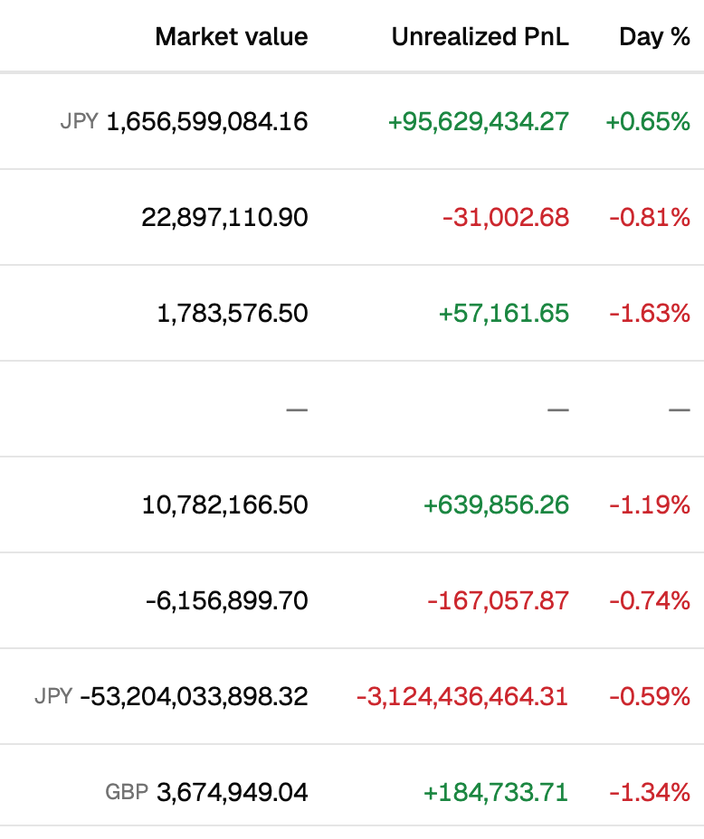
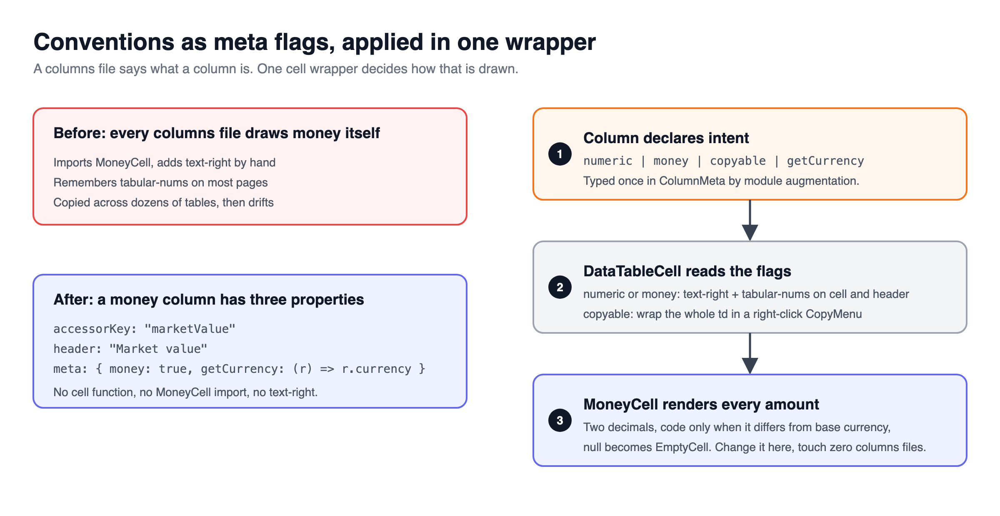

> [!TERMS]
>
> - **Cell** - one box in the table: one row, one column.
> - **Accessor** - the function that reads the raw value a column stands for. Sorting, filtering and copying use this, not what you draw.
> - **Reconcile** - checking figures line by line against another system, like a bank statement.
> - **Locale** - a country's number and date style: `1,640,750.00` in the US, `1.640.750,00` in Germany.
> - **ColumnDef.meta** - a free-form bag on each TanStack column where you can put your own flags.

[Part 7](#/docs/cell-design-grouping) covered when two fields share one cell and why sorting ignores what you draw.

## The big picture

> [!TLDR]
> Four small cell rules, applied once in shared components instead of copied into every page: a fixed money format, a shared empty marker, one flag per column, and a two-line limit.

Table: each row is a rule this doc sets, and what breaks on the page without it.

| Rule                             | What breaks without it                               |
| -------------------------------- | ---------------------------------------------------- |
| One `MoneyCell` for every amount | Two pages round or align digits differently          |
| One shared "no value" marker     | Some pages show 0.00, others a blank cell            |
| Columns declare `meta` flags     | Every columns file re-implements the same formatting |
| Two-line limit per cell          | Rows grow to different heights depending on the data |

> [!ANALOGY]
> A shared cell component is a stencil.
> Every page traces the same stencil, so the shape never drifts from page to page.

> [!RECAP]
>
> - Four small rules, applied once, instead of copied into every page.
> - The next four sections cover money, profit and empty cells, meta flags, then copying and row height.

## Money must look the same everywhere

> [!TLDR]
> People check (reconcile) money against statements, line by line.
> Put every money rule inside one `MoneyCell` component, so no page can get it wrong.

> [!ANALOGY]
> A shared `MoneyCell` is a rubber stamp.
> Every page presses the same stamp, so no page can hand-draw a slightly different one.

> [!STEPS]
>
> 1. **Always two decimals.** `1,640,750.00`, never `879,400.5` on the next row.
> 2. **Equal-width digits (`tabular-nums`)**, set inside the component, so no page can forget.
> 3. **One fixed locale.** Otherwise some readers see `1.640.750,00`, and the server and browser disagree.
> 4. **Show the currency code only when it differs from the book's own currency**, small and on the left, so the right edges of the numbers still line up.
> 5. **Show "no value" as a dash, never `0.00`.** Zero is a real claim about the value.



> [!NUANCE]-
>
> - Never shorten to "1.6M" in a table cell. It hides exactly the digits someone is trying to match.
> - With a second line under the amount, align the currency code to the top line, or it floats awkwardly between the two.

> [!RECAP]
>
> - Put every money rule inside one MoneyCell.
> - Two decimals, equal-width digits, one locale, and a currency code only when it differs.

## Profit, percentages and "no value"

> [!TLDR]
> One shared empty-cell marker, a plus or minus sign as well as a colour for profit, and a clear difference between "changed by 1.8%" and "is 1.8% of the portfolio".

Table: each row is a kind of cell, the rule for it, and the reason.

| Cell          | Rule                                           | Why                                                                        |
| ------------- | ---------------------------------------------- | -------------------------------------------------------------------------- |
| Empty         | One grey dash, with a label for screen readers | A blank could mean "failed to load"; "N/A" reads like a word among numbers |
| Profit / loss | A + or - sign as well as green or red          | Colour disappears on a black-and-white printout                            |
| Percent       | Format the number yourself, then add `%`       | The built-in percent style multiplies by 100, so 1.84 becomes 184%         |
| Loss colour   | Its own colour, not the "error red"            | A loss is normal information, not something broken                         |

> [!RECAP]
>
> - One shared dash means "no value" - never blank, never 0.00.
> - Profit needs a sign as well as a colour.

## Shared rules as column flags

> [!TLDR]
> Each column just says **what** it is (`money: true`).
> One shared wrapper decides **how** that looks.
> Change the money style once, and no column file needs touching.



> [!THINK]
> If the column only says "I am money", what does it no longer need to contain?
> Guess before you open it: no custom cell, no alignment classes.

```tsx title="market-value-column.tsx"
export const marketValueColumn: ColumnDef<PositionRow> = {
  accessorKey: "marketValue",
  header: "Market value",
  meta: { money: true }, // no custom cell, no alignment classes - the wrapper handles it
};
```

> [!GOTCHA]
> A "which currency?" flag often has three possible answers: a currency ("this amount is in EUR"), `null` ("already converted, show no code") and `undefined` ("use the row's own currency").
> Treat `null` and `undefined` as the same "empty" case, and a column already converted to dollars quietly picks up each row's local currency - labelling a dollar figure as euros.

> [!NUANCE]-
>
> - `meta` starts empty. You describe your flags by extending TanStack's type, which is the one place TypeScript needs `interface` instead of `type`.
> - Copying one cell's code into each page and tweaking it feels like research. It is how tables drift apart.

> [!WIN]-
> Money that matches the statement on every screen, and rules that live in one place instead of forty files.

> [!RECAP]
>
> - Columns say what they are with meta flags; one wrapper decides how they look.
> - null and undefined mean different things - never lump them together.

## Optional: copying, and the two-line limit

> [!TLDR]
> Put "Copy value" on right-click, which nothing else uses.
> Give every cell at most two lines, so every row is the same height.

> [!NUANCE]-
>
> - A copy icon in every row adds a second click target to a row that already opens a drawer.
> - Copy the raw value (`1640750`), not the drawn text, because that is what a spreadsheet wants.
> - Honest limit: keyboard users cannot right-click a cell, so also show the id as selectable text in the detail view.
> - Truncating long text inside a flex layout silently fails unless the container has `min-w-0`.
> - Status badges come from one lookup table, so "rejected" is the same red everywhere.

> [!RECAP]
>
> - Copy lives on right-click so the normal click stays free.
> - At most two lines per cell keeps every row the same height.

## Summary

> [!SUMMARY]
>
> - Lock money rules inside one MoneyCell: two decimals, equal-width digits, one locale.
> - Show "no value" as one shared dash, and give profit a sign as well as a colour.
> - Describe columns with meta flags and apply the look in one wrapper.
> - Keep null and undefined apart in any "which currency?" flag.
> - Copy the raw value on right-click, and cap cells at two lines.

```quiz
[
  {
    "q": "Some users see '1.640.750,00' in a table rendered on the server. What is missing?",
    "options": [
      "tabular-nums on the money cell",
      "A currency code for non-USD rows",
      "maximumFractionDigits set to two",
      "A pinned locale in the number formatter"
    ],
    "answer": 3,
    "expl": "Without a pinned locale, the browser formats in the user's locale and the server in its own, producing different strings and hydration errors. tabular-nums only changes digit width, not separators."
  },
  {
    "q": "Why does the currency code sit to the left of the amount rather than after it?",
    "options": [
      "Digit right-edges stay aligned with or without a code",
      "Screen readers announce the code first",
      "The code must be visually de-emphasised",
      "Most locales put the symbol first"
    ],
    "answer": 0,
    "expl": "A trailing code on only some rows would push those numbers left, breaking the aligned right edge readers compare against. De-emphasis is done with size and colour, not position."
  },
  {
    "q": "A position has no mark yet. Which rendering of its market value is right?",
    "options": [
      "0.00 in muted text",
      "An empty cell with no content",
      "A muted glyph with an aria-label",
      "The text N/A in small caps"
    ],
    "answer": 2,
    "expl": "0.00 is a claim about the value, blank is ambiguous with a failed load, and N/A reads as a word among numbers. One shared dash with a screen reader label says 'no value'."
  },
  {
    "q": "A day change of 1.84 renders as 184.00%. What caused it?",
    "options": [
      "The value was stored as a fraction",
      "The locale used a comma decimal",
      "signDisplay was set to always",
      "The formatter used style: 'percent'"
    ],
    "answer": 3,
    "expl": "style: 'percent' multiplies by 100. The value is already in percent units, so format the number and append the sign yourself."
  },
  {
    "q": "Which belong inside a shared MoneyCell rather than at each call site? Select all that apply.",
    "options": [
      "tabular-nums on the digits",
      "A fixed two-decimal format",
      "The column's sort direction",
      "Compact notation for large values"
    ],
    "answer": [0, 1],
    "multi": true,
    "expl": "Rules that live at call sites get forgotten, so lock digit style and precision in the component. Sorting is column logic, and compact notation is banned from cells."
  },
  {
    "q": "A column already converted to USD suddenly shows 'EUR' on European rows. getCurrency returns null for it. What bug is likely?",
    "options": [
      "The row currency was mapped incorrectly",
      "null and undefined shared one falsy check",
      "The meta flag was not typed by augmentation",
      "The CSV route overwrote the currency meta"
    ],
    "answer": 1,
    "expl": "null means 'deliberately no code'; undefined means 'use the row currency'. A falsy check sends null down the row-currency path."
  },
  {
    "q": "Which statements about copy-on-right-click are true? Select all that apply.",
    "options": [
      "It keeps the single click free for opening the row",
      "It should copy the accessor value, not the rendered text",
      "It is fully keyboard accessible by default on a td",
      "It removes the need for selectable ids elsewhere"
    ],
    "answer": [0, 1],
    "multi": true,
    "expl": "Right-click avoids a second click target and the raw value is what a spreadsheet wants. A td is not focusable, so keep the id selectable in the detail view."
  },
  {
    "q": "A two-line cell has truncate on its text but long names overflow anyway. What is missing?",
    "options": [
      "min-w-0 on the flex container",
      "overflow-hidden on the table cell",
      "whitespace-nowrap on the span",
      "A fixed max-width on the column"
    ],
    "answer": 0,
    "expl": "A flex child will not shrink below its content width unless min-width is zero, so truncate has nothing to clip. overflow-hidden on the cell hides the overflow but still gives no ellipsis."
  }
]
```

```related
[
  {
    "title": "Column definitions",
    "url": "https://tanstack.com/table/latest/docs/guide/column-defs",
    "source": "TanStack Table docs",
    "kind": "read",
    "note": "Where meta lives on a column, next to the accessor and the cell."
  },
  {
    "title": "Intl.NumberFormat() constructor",
    "url": "https://developer.mozilla.org/en-US/docs/Web/JavaScript/Reference/Global_Objects/Intl/NumberFormat/NumberFormat",
    "source": "MDN",
    "kind": "read",
    "note": "Locale, fraction digits, signDisplay and why style: 'percent' multiplies by 100."
  },
  {
    "title": "Tables pattern",
    "url": "https://www.w3.org/WAI/ARIA/apg/patterns/table/",
    "source": "W3C ARIA guide",
    "kind": "read",
    "note": "How screen readers expect table cells, including empty ones, to behave."
  },
  {
    "title": "Data Table III",
    "url": "https://www.greatfrontend.com/questions/user-interface/data-table-iii",
    "source": "GreatFrontEnd",
    "kind": "practice",
    "difficulty": "Hard",
    "note": "Generic columns are a good place to try meta flags and a shared cell wrapper."
  }
]
```
