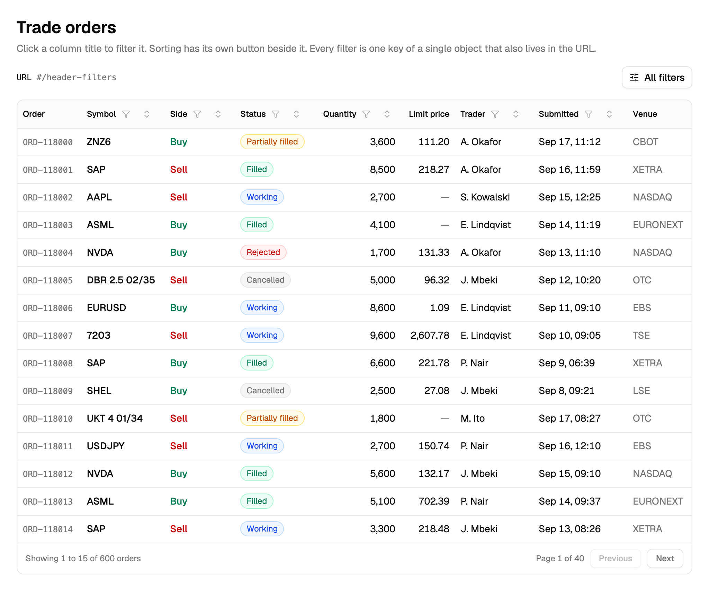
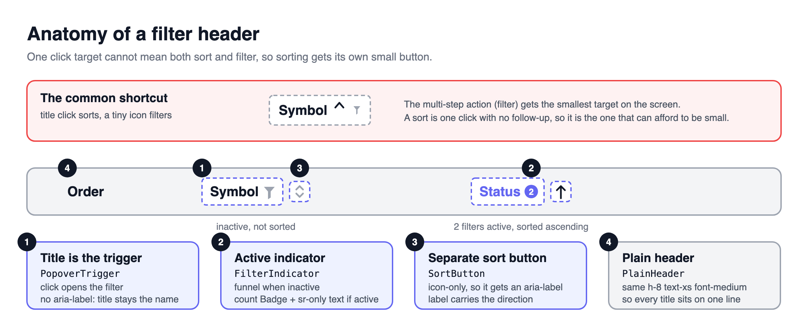
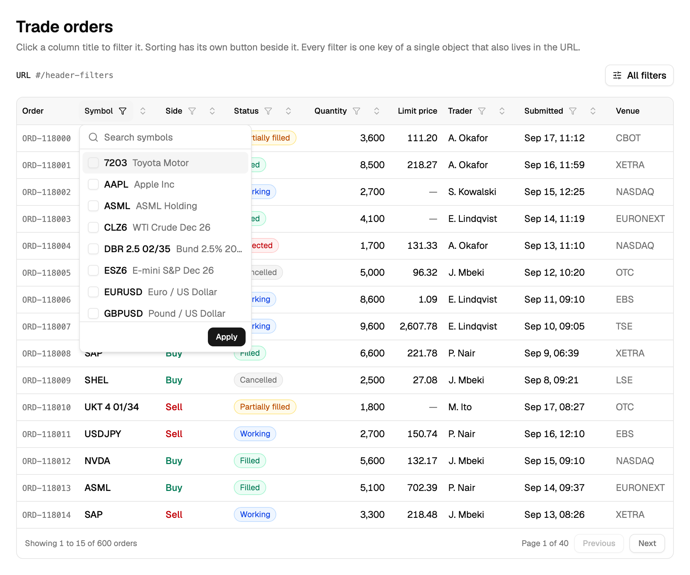
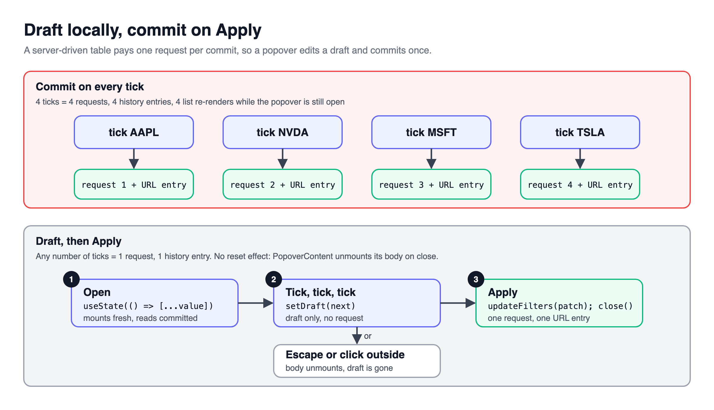
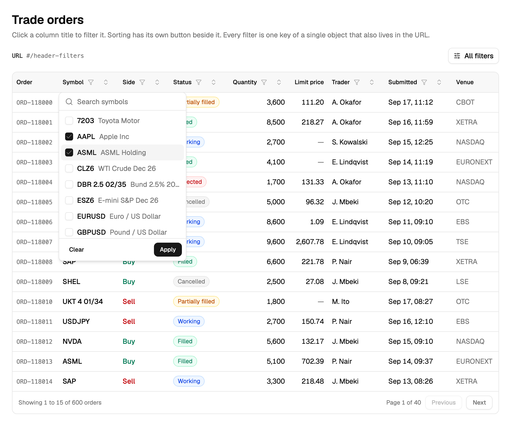
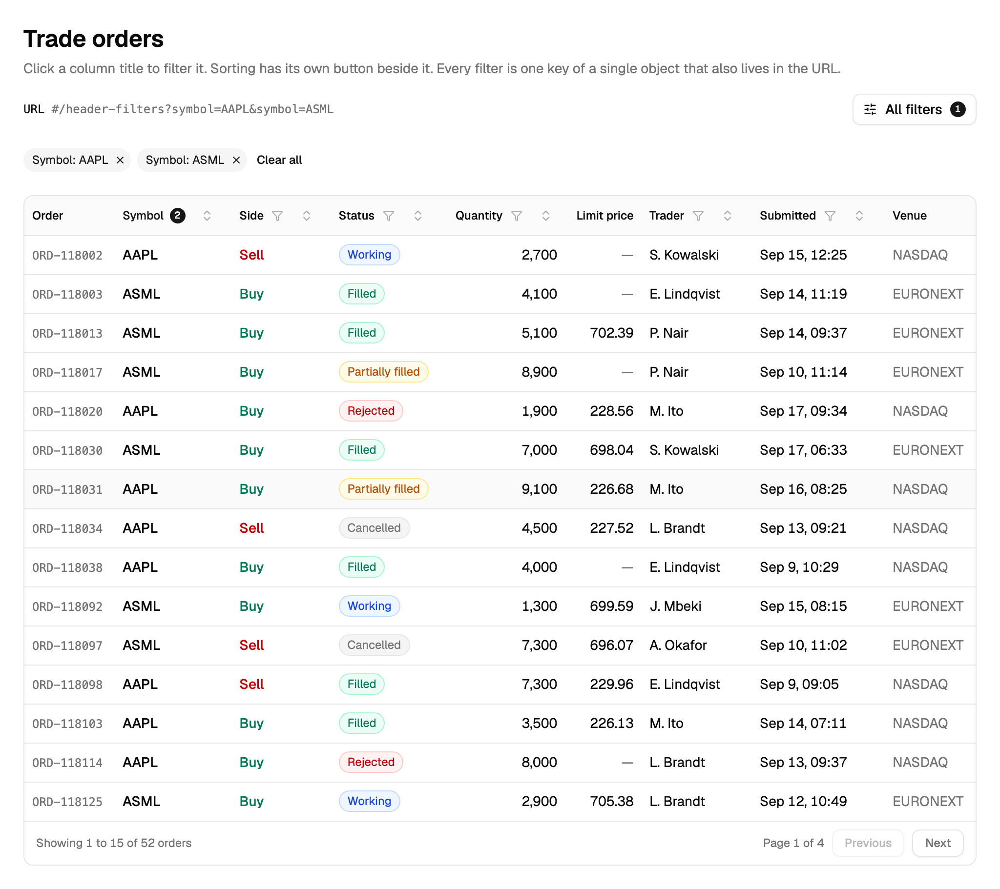

> [!TERMS]
>
> - **Header filter** - a filter you open by clicking a column's title, like in a spreadsheet.
> - **Popover** - a small floating panel that opens next to what you clicked.
> - **Draft** - your in-progress choices inside the popover, not yet applied.
> - **Commit / Apply** - turning the draft into the real filter the table uses.
> - **Chips** - small removable tags under the toolbar, one per active filter.
> - **aria-label** - an attribute that sets the name screen readers announce for a control.

## The big picture

> [!TLDR]
> Click a column's title to open its filter; a small separate button next to it sorts the column.
> Each popover keeps a draft of your choices and only touches the table once you press Apply.



A trading desk's orders blotter has the same shape as a spreadsheet: rows of orders, columns like Symbol, Status, Quantity and Submitted.
Everyone who has used a spreadsheet already knows the move: click the column header, tick two values, done.
Putting the filter on the title means nobody has to translate "narrow this column" into "find the right field in a form somewhere else".

This part builds one header filter end to end: the filter's shape, the header itself, and the draft-then-apply flow.
[Part 6](#/docs/header-filters-ranges-and-url) then scales it up: long lists, ranges, dates, and the URL.

> [!NUANCE]-
> A header filter is the wrong tool for "working orders OR anything from my desk", because that question crosses columns.
> Saved views are also the wrong fit here; those live in the toolbar, not a single header.

> [!RECAP]
>
> - A header filter opens from the column title; a small button next to it handles sorting.
> - This part covers one filter end to end; Part 6 scales it to many.

## Decide the shape of the filters first

> [!TLDR]
> Before any UI, write one plain object with one key per thing a trader can narrow.
> Only strings, numbers, lists of strings and `null` belong in it, so it survives a trip into a URL and back out.

Most filter bugs start the same way: state that grew one field at a time, kept in three different places that quietly drift apart.
So this starts with a type, not a popover.

> [!THINK]
> The blotter has Symbol, Status, Quantity and Submitted columns.
> Which of those need one value, a list of values, or a range?
> And what type should a date be, given it has to survive being written into a URL?

```ts title="order-filters.ts"
export type OrderFilters = {
  symbols: string[];
  statuses: OrderStatus[];
  quantityMin: number | null;
  quantityMax: number | null;
  submittedFrom: string | null; // "2026-09-17"
  submittedTo: string | null;
};
```

> [!NUANCE]-
>
> - Count active filters by group, not by field: a minimum and a maximum together count as one active filter on Quantity.
> - No `Date` objects belong in here. Dates live as text; `Date` only exists briefly, inside the calendar widget itself.

> [!RECAP]
>
> - Design the filter object before any component: plain values only.
> - A range's min and max count as one filter, not two.

## The filter header

> [!TLDR]
> One click target cannot mean both "sort" and "filter".
> Sorting is a single click, so it fits a small button.
> Filtering takes several steps, so it earns the big target: the column title itself.



> [!STEPS]
>
> 1. **The title opens the popover.** The popover can close itself after Apply, and it knows when it is open so it can fetch its option list right then.
> 2. **The funnel shows the state.** Grey when nothing is set; the title turns coloured with a count badge the moment a filter is active.
> 3. **Sort gets its own small button**, which shows the current direction, since a column can be filtered and sorted at the same time.
> 4. **Each popover decides where the cursor starts**, so a trader working the keyboard lands on the right control first.

> [!THINK]
> The title button already shows the word "Status" to everyone.
> How would you also tell a screen reader "filter, 2 active" without replacing that word?

```tsx title="filter-header.tsx"
<PopoverTrigger asChild>
  <Button variant="ghost" size="sm">
    {title}
    {count > 0 ? <Badge>{count}</Badge> : <FunnelIcon aria-hidden />}
    <span className="sr-only">, filter{count > 0 ? `, ${count} active` : ""}</span>
  </Button>
</PopoverTrigger>
<SortButton column={column} />
```

> [!GOTCHA]
> Do not add an `aria-label` to a button that already shows text.
> It replaces what screen readers and voice control hear, so a trader saying "click Status" stops finding the button.
> Add the extra words in hidden text instead, so the button reads as "Status, filter, 2 active".

A filtered column that does not look filtered reads to a trader as missing orders, not as a narrowed view.
The funnel and the badge exist to close exactly that gap.



> [!RECAP]
>
> - The title opens the filter; the funnel or badge shows whether it is on.
> - Never override visible button text with an aria-label; add hidden text instead.

## Draft, Apply, Clear

> [!TLDR]
> If every tick applied immediately, four ticks would mean four server requests and four Back-button stops.
> So each popover keeps its own draft, applies it once, and throws the draft away on Escape or a click outside.

> [!ANALOGY]
> A header filter is a shopping basket, not a vending machine.
> You gather everything you want inside the popover, then pay once at the till.



> [!THINK]
> Where should the draft live: on the page, or inside the popover's own body?
> When the popover closes and reopens later, how does the draft get back to the applied value?

```tsx title="symbol-filter-body.tsx"
const SymbolFilterBody = ({ applied, onApply, close }: Props) => {
  const [draft, setDraft] = useState(applied); // fresh on every open

  return (
    <>
      <SymbolList value={draft} onChange={setDraft} />
      <Button variant="ghost" onClick={() => setDraft([])}>
        Clear
      </Button>
      <Button
        onClick={() => {
          onApply(draft);
          close();
        }}
      >
        Apply
      </Button>
    </>
  );
};
```

No special reset code is needed anywhere.
The popover's content unmounts when it closes, so the next open mounts it fresh and starts again from the applied filter.



> [!NUANCE]-
>
> - A popover's own "Clear" clears only its own draft. "Clear all" lives with the chips row instead. Mixing the two up confuses traders about what they are about to lose.
> - Keep the popover content un-forced. Forcing it to stay mounted while closed would keep the stale draft sitting around for the next open.



> [!WIN]-
> Four ticks, one Apply, one request, one Back-button stop.
> Escape throws the whole draft away without a single line of reset code.

> [!RECAP]
>
> - Keep a draft inside the popover, apply it once, and let closing discard it.
> - A popover's Clear touches only its own draft, never every column at once.

## Summary

> [!SUMMARY]
>
> - Write the filter object first, with plain values that survive a trip through a URL.
> - Put filtering on the column title and sorting on its own small button.
> - Show filter state with a badge plus hidden text, never a text-overriding aria-label.
> - Draft inside the popover, apply once, and let unmounting do the resetting for you.
> - [Part 6](#/docs/header-filters-ranges-and-url) scales this to long lists, ranges, dates and the URL.

```quiz
[
  {
    "q": "A column header is one button: click to sort, and a funnel opens the filter. Traders keep sorting by accident. Best redesign?",
    "options": [
      "Title filters; a small button sorts",
      "Open the filter on right-click instead",
      "Require a double-click to sort the column",
      "Move both actions into a toolbar menu"
    ],
    "answer": 0,
    "expl": "A filter is multi-step and earns the large target; a sort is one click and survives a small one. Right-click and double-click are both undiscoverable on a data table."
  },
  {
    "q": "Which choices keep the filter object safe to write into a URL and read back? Select all that apply.",
    "options": [
      "A list of status strings for the column",
      "A submitted date stored as ISO text",
      "A Date object for the range's start day",
      "An onApply callback stored per column"
    ],
    "answer": [0, 1],
    "multi": true,
    "expl": "Strings, numbers and lists of strings turn into URL text and back unchanged. A Date object or a function cannot survive being written into a URL at all."
  },
  {
    "q": "The Quantity filter has both a minimum and a maximum set by a trader. What should the active-filter count show for it?",
    "options": [
      "Zero, until both bounds are valid",
      "One, for the whole range",
      "Two, one badge per bound",
      "The number of orders it matches"
    ],
    "answer": 1,
    "expl": "A trader thinks of a range as one filter, so a min and a max together count once. Counting each bound separately makes the badge disagree with the single chip they see."
  },
  {
    "q": "A teammate adds aria-label=\"Filter status\" to the Status title button, which already shows the word \"Status\". What breaks?",
    "options": [
      "The popover no longer opens on Enter",
      "The count badge stops rendering",
      "Voice control saying \"click Status\" misses it",
      "Keyboard focus skips the sort button"
    ],
    "answer": 2,
    "expl": "An aria-label replaces the visible text as the accessible name, so the spoken name no longer matches what the button shows. Hidden extra text adds words without replacing the title."
  },
  {
    "q": "In a server-driven blotter, each checkbox tick in a filter popover commits right away. What does a trader ticking four boxes cause?",
    "options": [
      "One request, sent after the fourth tick",
      "The popover closing after every tick",
      "A request and a history entry per tick",
      "Every other header losing its badge"
    ],
    "answer": 2,
    "expl": "Every commit is its own request and its own URL write, so four ticks mean four requests and four Back-button stops. A draft committed once on Apply sends exactly one."
  },
  {
    "q": "A popover body sets its draft from props with useState, and reopening it always shows the applied value with no reset effect written anywhere. Why does that work?",
    "options": [
      "useState silently re-reads its initial value",
      "The popover's content unmounts when it closes",
      "Radix clears form fields on the close event",
      "A context change forces the body to remount"
    ],
    "answer": 0,
    "expl": "Closing unmounts the popover body, so opening it again mounts it fresh and the initializer runs once more. useState never re-reads its initial value on its own, which is why forcing the body to stay mounted would break this."
  },
  {
    "q": "A popover's Clear button also wipes every other column's filters. What is the actual problem with that?",
    "options": [
      "It sends far more requests than needed",
      "Clear should only exist in the chips row",
      "It skips a schema validation step",
      "Local clear and table-wide clear are different jobs"
    ],
    "answer": 3,
    "expl": "Inside one popover, Clear should reset only that draft. Clearing everything belongs next to everything it clears, in the chips row, so mixing the two into one button confuses what a trader is about to lose."
  }
]
```

```related
[
  {
    "title": "Popover",
    "url": "https://ui.shadcn.com/docs/components/popover",
    "source": "shadcn/ui",
    "kind": "read",
    "note": "The component the header filter's popover is built on, including open/close control."
  },
  {
    "title": "aria-label",
    "url": "https://developer.mozilla.org/en-US/docs/Web/Accessibility/ARIA/Attributes/aria-label",
    "source": "MDN",
    "kind": "read",
    "note": "Why aria-label replaces visible text as the accessible name - the rule behind this doc's GOTCHA."
  },
  {
    "title": "Data Table III",
    "url": "https://www.greatfrontend.com/questions/user-interface/data-table-iii",
    "source": "GreatFrontEnd",
    "kind": "practice",
    "difficulty": "Medium",
    "note": "Add sorting and a toolbar to a data table - good practice for the sort-button split in this doc."
  },
  {
    "title": "Column filtering guide",
    "url": "https://tanstack.com/table/v8/docs/guide/column-filtering",
    "source": "TanStack Table docs",
    "kind": "read",
    "note": "The built-in column filter API this doc deliberately writes around for a server-driven table."
  }
]
```
