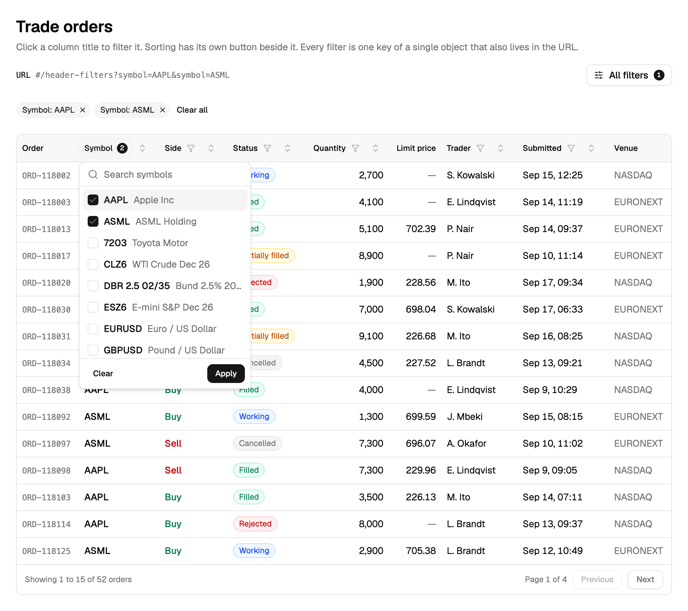
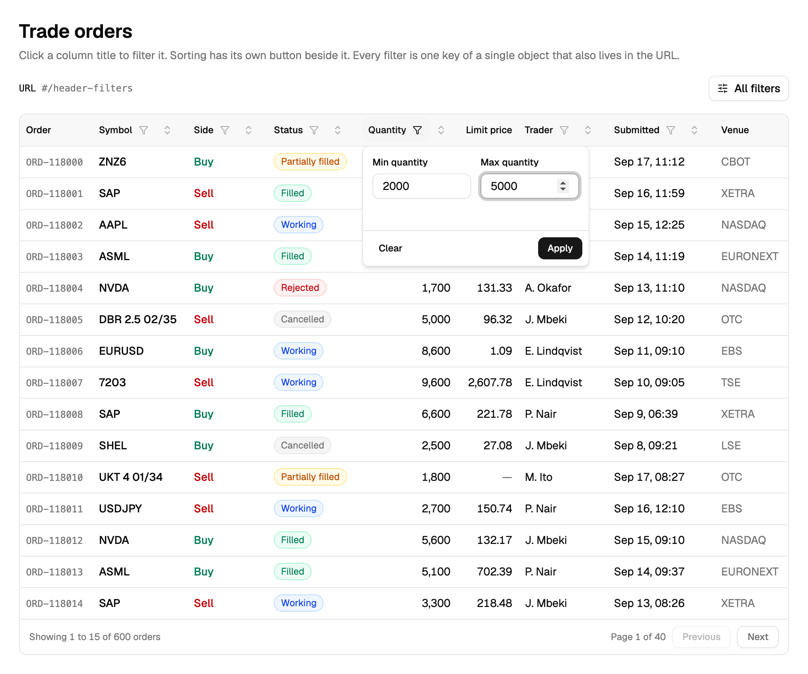
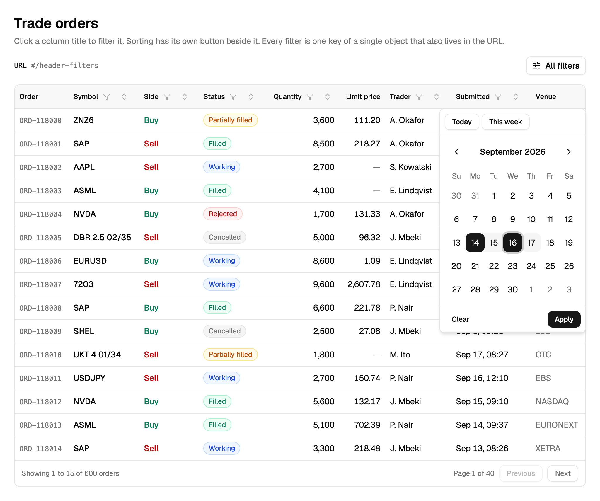
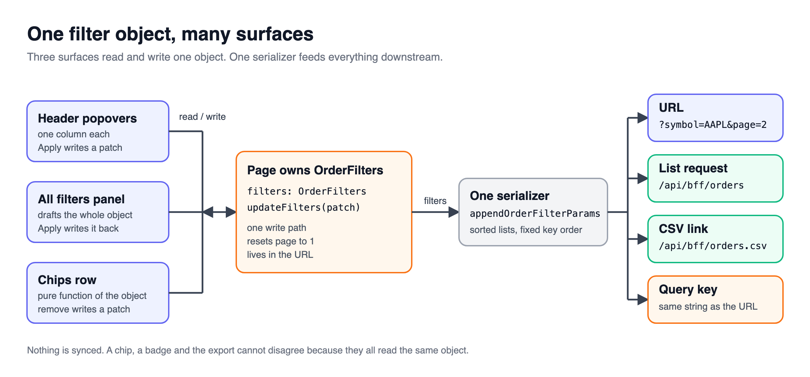
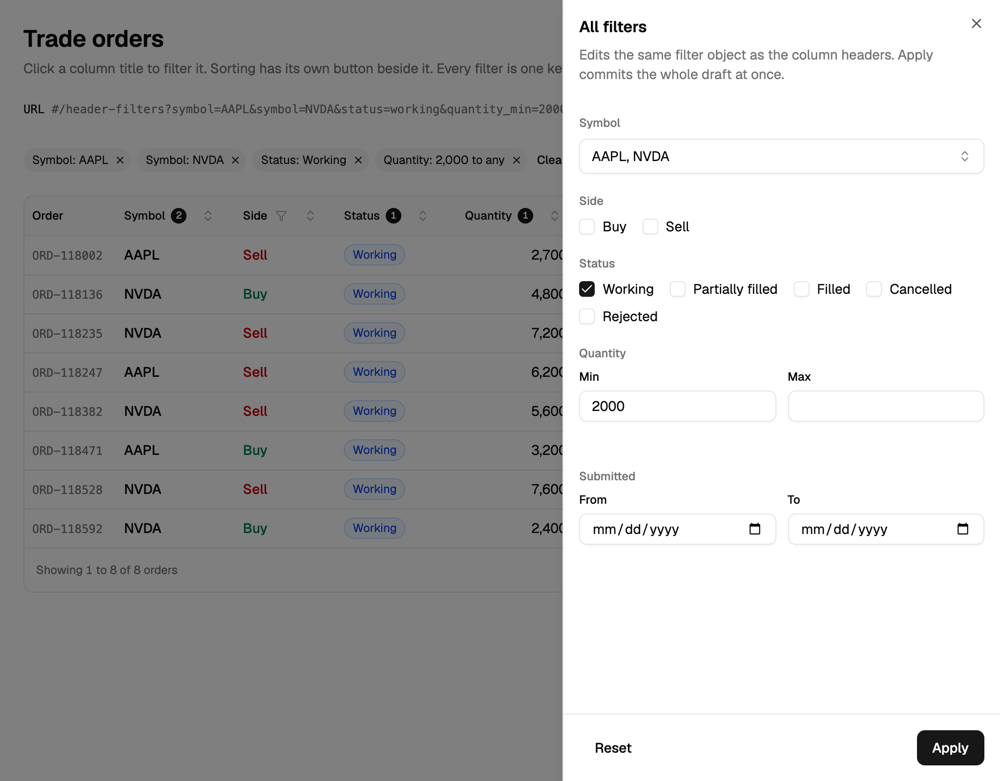
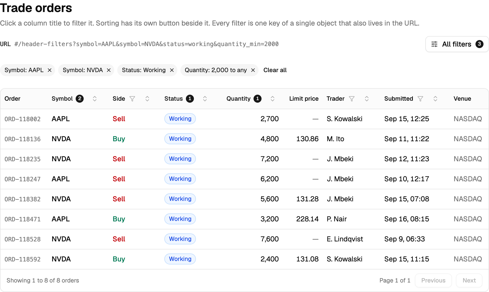

> [!TERMS]
>
> - **Option list** - the values a filter popover lets a trader tick, like every symbol that has ever traded.
> - **Chips** - small removable tags under the toolbar, one per active filter.
> - **Serializer** - a function that turns an object into text, here the `?key=value` part of a URL.
> - **Schema** - a description of valid data that also checks and cleans input, like a zod schema.
> - **ISO date** - a date written as `2026-09-17`, year first.
> - **UTC** - the world's reference clock, which runs hours ahead of New York.
> - **Hydration** - the browser taking over server-rendered HTML; both must produce the same markup.

## The big picture

> [!TLDR]
> A header popover, the "All filters" panel and the chips row all read and change the same one filter object.
> One serializer turns that object into the URL, the data request, the query cache key and the CSV export link.

[Part 5](#/docs/header-filters-popover) built one header filter: a typed filter object, a title that opens a popover, and a draft that applies once.
This part scales that idea up: long option lists, number ranges, dates, and one filter object shared by every surface and the URL.

Table: each row is a place in the UI, what it reads from the filter object, and what it is allowed to change.

| Place                     | Reads                              | Changes               |
| ------------------------- | ---------------------------------- | --------------------- |
| Header popovers           | Its own filter key                 | Its own key, on Apply |
| "All filters" panel       | A draft copy of everything         | Everything, on Apply  |
| Chips row                 | Every active filter                | Removes one value     |
| URL, data request, export | Everything, through one serializer | -                     |

> [!RECAP]
>
> - Every surface reads from one shared filter object.
> - Only headers, the "All filters" panel and chips are allowed to change it.

## Long option lists

> [!TLDR]
> A long option list loads from the server the first time its popover opens.
> It has to come from **all** of a trader's data, never from the rows the table currently shows.

If the Symbol list came from the filtered rows on screen, ticking one symbol would shrink the list down to just that symbol, and nothing else would ever be pickable again.

> [!THINK]
> When should the options request fire, and what should its cache key depend on?
> Hint: not on the currently applied filters.

```ts title="use-symbol-options.ts"
export const useSymbolOptions = (open: boolean) =>
  useQuery({
    queryKey: ["orders", "symbol-options"], // no filters: the whole baseline
    queryFn: fetchSymbolOptions,
    enabled: open, // first open only, then cached
    staleTime: 5 * 60_000,
  });
```



> [!NUANCE]-
>
> - Put already-applied items at the top of the list, sorted by the **applied** value, not the draft, or rows jump around under the cursor as a trader ticks new boxes.
> - Let "nvidia" find `NVDA` by giving each option a few extra search words behind the scenes.
> - If the options request fails, say so and offer a retry. An empty list means "nothing exists", which is a different fact than "the request failed".

> [!RECAP]
>
> - Load long option lists once, on first open, from a trader's whole baseline.
> - Sort selected-first using the applied value, never the in-progress draft.

## Number ranges and dates

> [!TLDR]
> A number range keeps whatever the trader typed as plain text until Apply.
> A date only becomes a `Date` object briefly, inside the calendar widget itself.

A half-typed number like `1e` is not a valid number yet.
Store it as a number too early and the input snaps back to empty in the middle of a keystroke.

> [!THINK]
> What should the draft hold while a trader is still typing, and where should parsing happen?

```ts title="quantity-range-draft.ts"
const [minText, setMinText] = useState(applied.min?.toString() ?? "");
const min = minText === "" ? null : Number(minText); // derived each render
const error = min !== null && Number.isNaN(min) ? "Enter a number" : null;
```



> [!GOTCHA]
> `new Date("2026-09-17")` means midnight in **UTC**, the world's reference clock, which is still the evening of the 16th in New York.
> So the calendar highlights the wrong day for a trader on the US East Coast.
> Build the date from year, month and day in local time, store the plain `2026-09-17` text, and let the server decide exactly when a trading day starts.

> [!THINK]
> Given the string "2026-09-17", how do you get a local-midnight `Date` without hitting the UTC trap above?

```ts title="iso-date.ts"
export const fromIsoDate = (iso: string) => {
  const [y, m, d] = iso.split("-").map(Number);

  return new Date(y, m - 1, d); // local midnight
};
```



> [!NUANCE]-
> Work out what "Today" and "This week" mean only inside the click handler that runs the preset.
> Reading the clock during render instead makes the server's first render and the browser's first render disagree, which breaks hydration.

> [!RECAP]
>
> - Keep a half-typed number as text, and derive the parsed value on every render.
> - Never turn a date string into a `Date` anywhere outside the calendar itself.

## One object, many places

> [!TLDR]
> The usual bug here is two surfaces disagreeing: a chip says one symbol, a header badge says a different count.
> The fix is to keep only one copy of the filters, so there is nothing left that could ever fall out of sync.

> [!ANALOGY]
> The filter object is the single scoreboard bolted to the wall of a trading floor.
> Every screen around the room shows it; nobody is keeping their own private tally.



> [!STEPS]
>
> 1. **The page owns the object** and shares it, plus one `updateFilters` function, with every component below it.
> 2. **`updateFilters` also resets to page 1**, because page 7 of the full order list will not exist once the list only has 12 rows left.
> 3. **Chips are derived from the object**, and each chip knows how to remove only its own value.
> 4. **The "All filters" panel keeps its own draft too**, and applies it all at once, just like a single popover does.

> [!NUANCE]-
> Share the object through React context rather than passing it into `getColumns(filters)` to rebuild the column list.
> Rebuilt columns hand every header a new identity, so React restarts them and closes any popover that happened to be open.



> [!RECAP]
>
> - One shared filter object means there is nothing left to keep in sync.
> - `updateFilters` resets the page too, or a stale page number can point past the end of the list.

## Into the URL and to the server

> [!TLDR]
> One function writes the filter object into the URL.
> One schema reads it back out, the same way in the browser and on the server.



> [!THINK]
> One trader picks NVDA then AAPL; another picks AAPL then NVDA.
> What must the writer do so both end up with the same URL and share one cache entry?

```ts title="filters-to-params.ts"
export const filtersToParams = (f: OrderFilters) => {
  const p = new URLSearchParams();
  [...f.symbols].sort().forEach((s) => p.append("symbol", s));
  [...f.statuses].sort().forEach((s) => p.append("status", s));
  if (f.quantityMin !== null) p.set("quantity_min", String(f.quantityMin));

  return p; // defaults skipped, fixed key order
};
```

> [!NUANCE]-
>
> - Anyone can type anything into a URL. A nonsense value like `?status=banana` should quietly mean "no status filter", never an error page.
> - The data request, the preload and the export link all call the same writer, so the CSV export always matches whatever is on screen.
> - For a table whose rows are all already in the browser, TanStack's own column filters work well and hand you option counts for free.
> - For a server-driven table, TanStack's filter state is just one more untyped layer to translate in and out of. Skip it and go straight to `OrderFilters`.

> [!INTERVIEW]-
>
> - _What did an unused filter API teach a shared table kit's maintainers?_ It shipped a second filter API that no page ever adopted, and it quietly became dead code. Build the shared version after the second real use, never before the first.

> [!WIN]-
> Every chip, badge, URL and export agrees with every other one, because there is exactly one filter object and exactly one writer for it.

> [!RECAP]
>
> - One function writes the URL; one schema reads it back, on both ends.
> - A nonsense URL value should quietly resolve to "no filter", not an error.

## Summary

> [!SUMMARY]
>
> - Load long option lists lazily, from a trader's whole baseline, sorted selected-first by the applied value.
> - Keep half-typed numbers as text and every date as ISO text, never as a `Date`, until the last possible moment.
> - Let exactly one page-owned filter object feed the headers, the "All filters" panel and the chips.
> - Use one writer to build the URL, the request and the export, and one schema to read it all back.

```quiz
[
  {
    "q": "The Symbol picker only lists symbols from the current page of orders on screen. What should its options actually come from?",
    "options": [
      "The unfiltered per-trader baseline",
      "The current filtered result set",
      "Unique values pulled from the loaded rows",
      "A static list bundled into the client"
    ],
    "answer": 0,
    "expl": "Options built from filtered or loaded rows shrink to whatever is already chosen. Only the unfiltered, scoped baseline keeps every valid symbol available to pick."
  },
  {
    "q": "Ticking a symbol makes that row jump to the top of the list while the trader's cursor is still on it. What is the likely cause?",
    "options": [
      "The options query refetches after every tick",
      "Selected-first sorting is reading the live draft",
      "The search box re-sorts by relevance on each tick",
      "Extra search keywords are reordering the matches"
    ],
    "answer": 1,
    "expl": "Sorting selected items first from the in-progress draft moves rows the instant a box is ticked. Sorting by the applied value instead means nothing moves until Apply."
  },
  {
    "q": "The symbol options request fails, and the picker currently shows \"No symbols found\". What should it show instead?",
    "options": [
      "A disabled popover trigger",
      "An empty list with a loading skeleton",
      "The last cached options, shown silently",
      "An error message with a retry action"
    ],
    "answer": 3,
    "expl": "\"No symbols exist\" and \"the request failed\" are two different facts. Showing an empty list, cached or not, hides the outage from the trader."
  },
  {
    "q": "The Quantity draft stores parsed numbers. Typing \"1e\" makes the input jump back to empty mid-keystroke. What is the fix?",
    "options": [
      "Debounce the parsing by 300 ms",
      "Switch the input to type=\"number\"",
      "Keep the text draft, parse on every render",
      "Parse the value only on the Apply click"
    ],
    "answer": 2,
    "expl": "A half-typed value like \"1e\" is not a number yet. Keeping the text and deriving the parsed number and any error on each render means they can never fall out of step with each other."
  },
  {
    "q": "A trader in New York picks 17 September, but the calendar highlights the 16th. The code runs new Date(\"2026-09-17\"). Why?",
    "options": [
      "The locale was never pinned to en-US",
      "Date-only ISO strings parse as UTC midnight",
      "toISOString silently drops the day component",
      "The calendar library keeps its own UTC clock"
    ],
    "answer": 1,
    "expl": "A date-only ISO string parses as midnight UTC, which is still the previous evening in New York. Building the date from local year, month and day sidesteps the whole trap."
  },
  {
    "q": "Which choices keep a date filter hydration-safe? Select all that apply.",
    "options": [
      "Storing the filter's dates as ISO strings",
      "Defaulting the range to the current week on render",
      "Computing \"This week\" only inside the click handler",
      "Storing Date objects so both sides share one type"
    ],
    "answer": [0, 2],
    "multi": true,
    "expl": "Strings serialize identically everywhere, and reading the clock only inside a handler keeps the first render deterministic. Defaulting from the clock during render, or storing Date objects, makes the server and browser disagree."
  },
  {
    "q": "Column headers are rebuilt as getColumns(filters) on every filter change, and an open popover keeps flashing closed. Why?",
    "options": [
      "Popover open state is stored inside a column",
      "A freshly built columns array remounts every header",
      "The filters object has grown too large to diff",
      "The context provider re-renders the whole table root"
    ],
    "answer": 1,
    "expl": "A rebuilt columns array hands headers new identities on every change, and React remounts them from scratch. Reading filters from context instead keeps the columns array itself stable."
  },
  {
    "q": "Which properties make the filter serializer's URL output canonical, so two equivalent views share one cache entry? Select all that apply.",
    "options": [
      "Default values are skipped entirely",
      "List values are sorted before being written",
      "Keys are written in whatever order the trader clicked",
      "Every value is base64 encoded before writing"
    ],
    "answer": [0, 1],
    "multi": true,
    "expl": "Skipping defaults and sorting lists means two equivalent views always produce the same URL string. Writing keys in click order would make the same view produce a different URL depending on how the trader got there."
  }
]
```

```related
[
  {
    "title": "Column faceting",
    "url": "https://tanstack.com/table/v8/docs/guide/column-faceting",
    "source": "TanStack Table docs",
    "kind": "read",
    "note": "Option lists with live counts, computed from the other active filters."
  },
  {
    "title": "URLSearchParams",
    "url": "https://developer.mozilla.org/en-US/docs/Web/API/URLSearchParams",
    "source": "MDN",
    "kind": "read",
    "note": "The API the filters-to-params writer in this doc is built on."
  },
  {
    "title": "Data Table IV",
    "url": "https://www.greatfrontend.com/questions/user-interface/data-table-iv",
    "source": "GreatFrontEnd",
    "kind": "practice",
    "difficulty": "Hard",
    "note": "Add filtering to a generic table, then try wiring the filters into the URL yourself."
  },
  {
    "title": "Debounce",
    "url": "https://www.greatfrontend.com/questions/javascript/debounce",
    "source": "GreatFrontEnd",
    "kind": "practice",
    "note": "The helper behind search boxes that avoid firing a request on every keystroke."
  }
]
```
