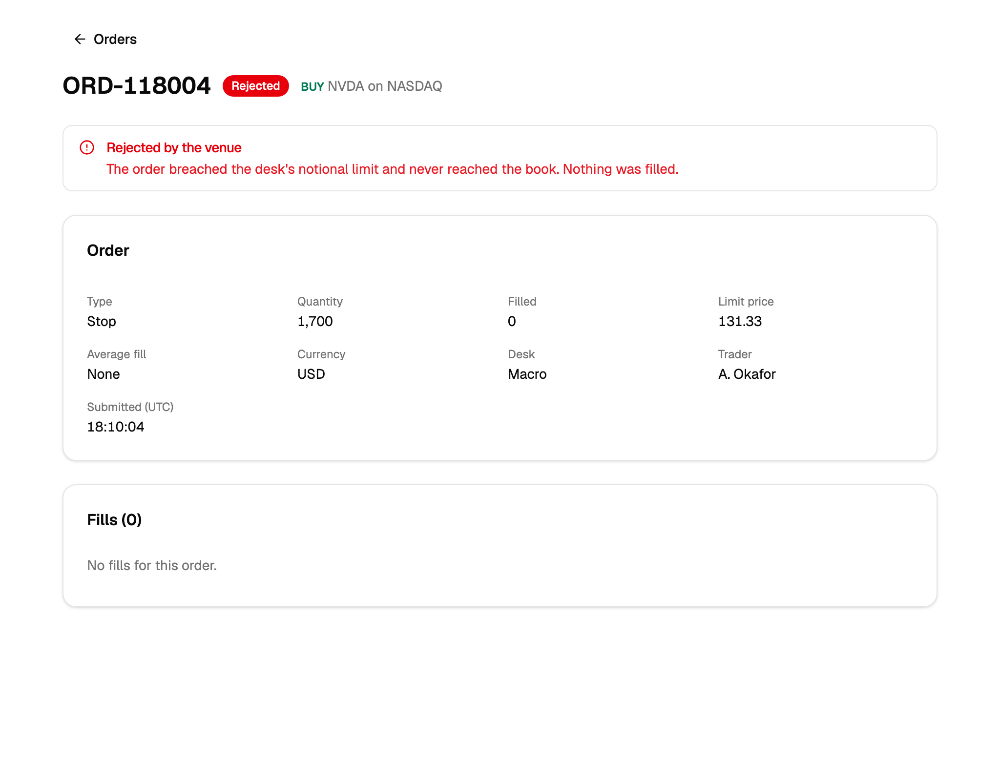
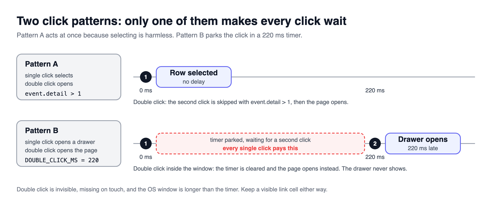

> [!TERMS]
> - **Row click** - what happens when someone clicks anywhere on a row.
> - **Detail page** - a separate page, with its own URL, for one record.
> - **Master-detail** - a list on one side and the selected record always open on the other, like an email inbox.
> - **Search param** - the `?key=value` part of a URL.
> - **Focus ring** - the outline that shows which element the keyboard is on.
> - **Click count (event.detail)** - how many clicks in a row the browser has counted for this click event.

[Part 11](#/docs/row-click-patterns) picked a row click by the user's next step and built the guarded handler, the expando and the URL-driven drawer.

> [!TLDR]
> A row that navigates still needs a real link, double click costs speed unless one click only selects, and a clickable row needs Enter, Space and a visible focus ring.

> [!ANALOGY]
> A clickable row without a link or keyboard support is a door with no handle.
> Mouse users can push it open; everyone else walks past without knowing it is a door.

## Detail page: a real link first

> [!TLDR]
> If a row goes to another page, its first cell still needs a real link.
> Clicking anywhere on the row is a convenience on top.

> [!NUANCE]
> - A real link lets people cmd-click or middle-click to open a new tab, right-click to copy the address, and hear "link" on a screen reader. A click handler that navigates gives none of that.
> - Clicking the link does not also trigger the row, because the guard ignores links.
> - Back returns to the exact same list only because the filters and page live in the URL (part 2).



> [!RECAP]
> - A row that navigates still needs a real link in its first cell.
> - Back works because the list state lives in the URL.

## Single click and double click

> [!TLDR]
> If one click selects and a double click opens, you can act instantly.
> If both open something, every single click has to wait to see whether a second is coming.



> [!STEPS]
> 1. **Click selects, double click opens.** A double click sends two clicks first; ignore the second one (`event.detail > 1`) so it does not un-select.
> 2. **Click opens a drawer, double click opens a page.** Now the first click must wait about 220ms for a possible second one.
> 3. **Always offer a visible way too**, like a link or an "Open" menu item.

> [!NUANCE]-
> - Double click is hard to discover and does not exist on touch screens.
> - Prefer the first pattern, or no double click at all.

> [!RECAP]
> - If one click selects, ignore the second click of a double click.
> - If both clicks open something, every click waits - avoid it.

## Keyboard: make the row reachable

> [!TLDR]
> A clickable row is invisible to the keyboard unless you make it focusable and handle Enter and Space.

> [!THINK]
> Which rows should the Tab key stop on?
> If the focus is on the expando arrow inside the row and the user presses Enter, what should happen - and what must not?

```tsx title="data-table-row.tsx"
<TableRow
  tabIndex={onRowClick ? 0 : undefined}
  onKeyDown={(event) => {
    if (event.target !== event.currentTarget) return; // Enter on a child button is not ours
    if (event.key !== "Enter" && event.key !== " ") return;
    event.preventDefault();
    onRowClick?.(row);
  }}
  className="focus-visible:ring-2 focus-visible:ring-inset"
/>
```

> [!NUANCE]-
> - Put `tabIndex={0}` only on rows that do something.
> - Show the focus ring only for keyboard users (`focus-visible`), and draw it inside the row (inset), or the table's scroll box cuts it off.

> [!RECAP]
> - Clickable rows need tabIndex, Enter and Space, and a visible focus ring.
> - Only act when the row itself is focused, so a child button's Enter does not also open the row.

## Optional: master-detail and styling

> [!TLDR]
> Master-detail keeps its whole state in one search param, and a few small styling choices make the open row easy to see.

- Master-detail: one `?sel=` param in the URL is the whole state.
- If it is missing, choose the first row while drawing, rather than writing it into the URL afterwards, which causes a flash of an empty panel.
- The end goal is one prop per table, like `rowAction={{ single: "select", double: "navigate" }}`, so the table handles the mechanics and nobody reinvents them.

Table: each row is a small styling choice and the reason for it.

| Style | Why |
| --- | --- |
| Hover lighter than selected | The open row stays obvious while the mouse moves |
| No line between a row and its children | They read as one unit |
| A red edge drawn as a shadow, not a border | A border would push the row's content sideways |
| A wider drawer | The default is cramped for financial data |

> [!WIN]-
> One guarded click handler in the shared table, the open record in the URL, real links for real navigation, and one clear setting per table.

> [!RECAP]
> - Master-detail derives a missing selection while rendering, not in an effect.
> - One rowAction setting per table keeps behaviour consistent.

## Summary

> [!SUMMARY]
> - A row that navigates needs a real link in its first cell.
> - Prefer "click selects, double click opens", or no double click at all.
> - A clickable row needs tabIndex, Enter and Space, and an inset focus-visible ring.
> - Master-detail lives in one `?sel=` param, with the fallback computed while rendering.

```quiz
[
  {
    "q": "A row navigates via onClick={() => navigate(url)}. Which capabilities are lost compared with a real link in the first cell? Select all that apply.",
    "options": [
      "Cmd-click or middle-click to open a new tab",
      "Right-click 'Copy link address'",
      "Client-side routing without a page reload",
      "Prefetching data on navigation"
    ],
    "answer": [0, 1],
    "multi": true,
    "expl": "Only an anchor gives new-tab gestures, the link context menu and a link announcement. navigate() still routes client-side, and prefetching is separate."
  },
  {
    "q": "Single click selects a row and double click opens it. Double-clicking selects and then immediately deselects. Fix?",
    "options": [
      "Add a 220 ms timer before selecting",
      "Skip selecting when event.detail > 1",
      "Handle selection in onMouseDown instead",
      "Call preventDefault in the dblclick handler"
    ],
    "answer": 1,
    "expl": "A double click fires two click events first. Checking the click count keeps the first click instant and ignores the second."
  },
  {
    "q": "Why is 'single click opens drawer, double click opens page' costly?",
    "options": [
      "Each single click waits on a timer",
      "It requires two separate event listeners",
      "Browsers throttle dblclick on table rows",
      "It breaks the portal guard"
    ],
    "answer": 0,
    "expl": "Both actions open something, so the first click cannot act until the double-click window passes, delaying every single click."
  },
  {
    "q": "A keyboard user presses Enter on a focused chevron button and both the expand and the row's drawer fire. What is missing?",
    "options": [
      "tabIndex={-1} on the chevron",
      "aria-expanded on the table row",
      "An onKeyUp handler instead of onKeyDown",
      "A target === currentTarget check"
    ],
    "answer": 3,
    "expl": "The keydown bubbles from the chevron to the row. The row should act only when it is itself the focused target."
  },
  {
    "q": "The row focus ring is clipped at the table's left edge. What fixes it?",
    "options": [
      "Use focus instead of focus-visible",
      "Add overflow-visible to each cell",
      "Use an inset ring",
      "Increase the ring offset"
    ],
    "answer": 2,
    "expl": "The scroll container clips anything outside the row box. An inset ring draws inside it, while a larger offset pushes it further out."
  },
  {
    "q": "A master-detail page writes the first row's id into ?sel= in an effect when the param is missing. What is the downside?",
    "options": [
      "It creates a duplicate history entry and nothing else",
      "The param is lost on the next sort",
      "Effects cannot call setSearchParams",
      "An empty pane flashes; SSR can differ"
    ],
    "answer": 3,
    "expl": "The effect runs after a render with no selection, so the pane flashes empty. Computing the fallback during render avoids the flash and keeps SSR consistent."
  },
  {
    "q": "A 4px red urgency marker as border-left on the first cell makes rejected rows' text shift. Better approach?",
    "options": [
      "Add a 4px transparent border to every row",
      "An inset box-shadow on the first cell",
      "A separate 4px column for the marker",
      "Negative margin on the first cell"
    ],
    "answer": 1,
    "expl": "A box-shadow occupies no layout space, so nothing moves. A transparent border on every row works but costs width everywhere."
  }
]
```

```related
[
  {
    "title": "Tables pattern",
    "url": "https://www.w3.org/WAI/ARIA/apg/patterns/table/",
    "source": "W3C ARIA guide",
    "kind": "read",
    "note": "What keyboard and screen-reader users expect from a table."
  },
  {
    "title": "Modal Dialog",
    "url": "https://www.greatfrontend.com/questions/user-interface/modal-dialog",
    "source": "GreatFrontEnd",
    "kind": "practice",
    "note": "Focus handling and keyboard rules for panels that open from a row."
  },
  {
    "title": "Accordion",
    "url": "https://www.greatfrontend.com/questions/user-interface/accordion",
    "source": "GreatFrontEnd",
    "kind": "practice",
    "note": "Keyboard support for controls that open and close content in place."
  }
]
```
