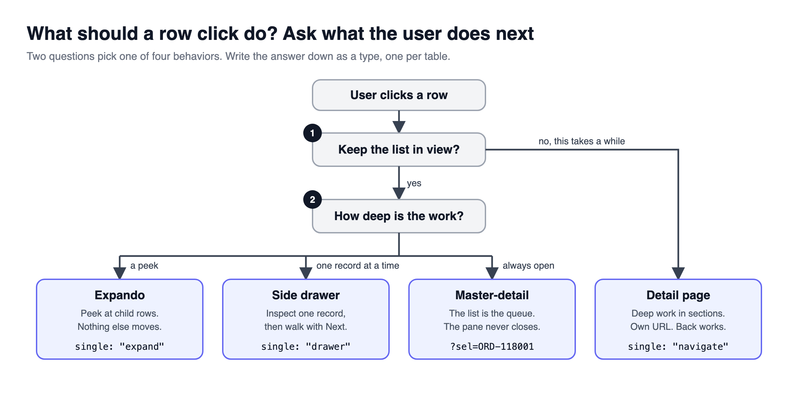
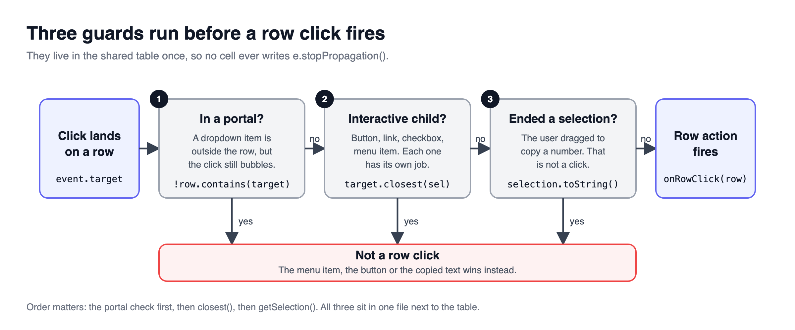
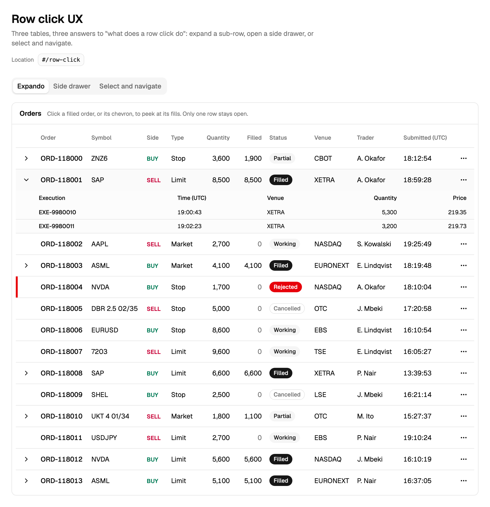
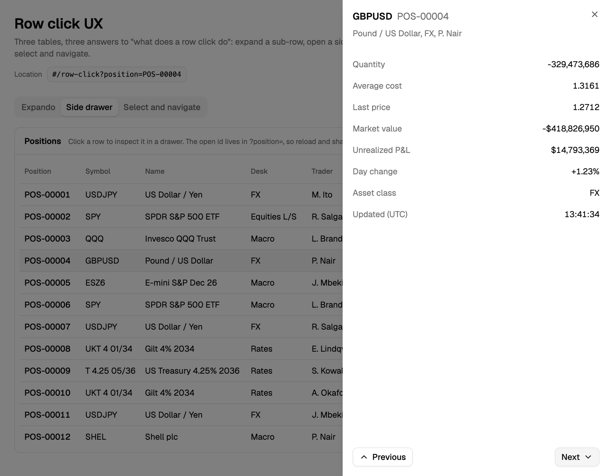

> [!TERMS]
> - **Row click** - what happens when someone clicks anywhere on a row.
> - **Expando** - a row that opens in place to show extra rows underneath it.
> - **Side drawer (Sheet)** - a panel that slides in from the side, over the list.
> - **Detail page** - a separate page, with its own URL, for one record.
> - **Master-detail** - a list on one side and the selected record always open on the other, like an email inbox.
> - **Portal** - a component whose HTML is placed somewhere else in the page, such as a dropdown menu.
> - **Search param** - the `?key=value` part of a URL.

> [!TLDR]
> A pointer cursor is a promise that clicking does something useful.
> Pick one row click per table by what the user does next, guard the click once in the shared table, and keep an open drawer in the URL.

> [!ANALOGY]
> A row click is like a door in a hallway.
> A cupboard (expando) you peek into and close, a side room (drawer) you step into and step out of, a whole new floor (detail page) you stay on for a while.
> You pick the door by how long the visitor wants to stay.

## The big picture

> [!TLDR]
> A row click can mean four different things, and people only learn one per table - so choose by what the user wants to do **next**.



Table: find what the user wants to do after clicking; the left column is the pattern to use.

| Option | Use it when the user wants to... | Their next step |
| --- | --- | --- |
| Expando | Peek at a few child rows | Keep scanning the list |
| Side drawer | Check or lightly edit one record | Look at the next row |
| Detail page | Do deep work across several sections | Stay here for ten minutes |
| Master-detail | Work through the list like a to-do queue | Go through records one after another |

This part covers the two patterns that keep the list in view: expando and side drawer.
The next part covers detail pages, double click and keyboard support.

> [!NUANCE]-
> - Write the choice down as a TypeScript type with one option per table. A type forces you to pick one.
> - Only show a pointer cursor when a click actually does something.

> [!RECAP]
> - Choose the row click by what the user does next.
> - Only show a pointer cursor when a click really does something.

## One click handler, with three guards

> [!TLDR]
> The shared table owns the click handler, and it ignores three kinds of click: one that ends a text selection, one on a button or link inside the row, and one inside a menu the row opened.



> [!THINK]
> A user drags across an amount to copy it and lets go. Is that a click?
> A user picks "Delete" in a row's dropdown menu. Does the row hear that click?
> Write down which checks the handler needs before it calls `onRowClick`.

```ts title="data-table.tsx"
const handleRowClick = (event: MouseEvent<HTMLTableRowElement>, row: Row<TData>) => {
  const target = event.target;

  if (!(target instanceof Element)) return;
  if (!event.currentTarget.contains(target)) return;            // clicked inside a menu (portal)
  if (hitInteractiveChild(target, event.currentTarget)) return; // clicked a button, link or checkbox
  if (endedTextSelection()) return;                             // the user was copying a number

  onRowClick?.(row);
};
```

> [!NUANCE]-
> - Dragging to select a number and letting go counts as a click. Without the text-selection guard, copying a number navigates away.
> - A dropdown menu's items live elsewhere in the page (a portal), but React still passes their clicks up to the row. The check "is the click actually inside this row?" catches that.
> - Check `instanceof Element`, not `HTMLElement`: an icon inside a button is an SVG element.

> [!GOTCHA]
> If the shared table does not guard clicks on buttons inside the row, every cell with a button has to stop the click itself.
> Forget it once and ticking a checkbox also opens the drawer.
> Put the guard in the shared table, then delete every hand-written click-stopper from your cells.

> [!RECAP]
> - One handler in the shared table, with three guards: text selection, inner controls, menus.
> - Delete hand-written click stoppers from cells.

## Expando: peek at child rows

> [!TLDR]
> Let TanStack track which rows are open, allow only one open at a time, and let only rows that actually have children show an arrow.

> [!STEPS]
> 1. **Decide which rows can open** with `getRowCanExpand`. A working order with no fills shows no arrow and does not look clickable.
> 2. **Keep one open at a time.** Opening a row closes the previous one.
> 3. **Give the arrow a real `Button`.** That is what keyboard and screen-reader users use; clicking the row is a bigger target on top.
> 4. **Draw the children as a second row** whose single cell spans every visible column.

> [!NUANCE]-
> - The click guard recognises the arrow button, so clicking it does not open and close in one go.
> - `aria-expanded` (which tells screen readers "open" or "closed") goes on the arrow button, not the row.



> [!RECAP]
> - Only rows with children get an arrow.
> - Keep one row open at a time, and give the arrow a real button.

## Side drawer: keep the open row in the URL

> [!TLDR]
> Whatever a click opens, put its id in the URL.
> Then refreshing keeps it open and a colleague can open the same record from a link.

> [!THINK]
> The page already has `?status=open&sort=amount` in the URL. How do you add `position=POS-00004` without losing those?
> What should the Back button do after someone opens ten drawers?
> And should the list scroll to the top each time?

```ts title="use-open-position.ts"
const open = (id: string) =>
  setSearchParams(
    (prev) => { const next = new URLSearchParams(prev); next.set("position", id); return next; },
    { replace: true, preventScrollReset: true },
  );
```

> [!NUANCE]-
> - Copy the existing params first, so the filters and sort survive.
> - `replace: true` stops each opened drawer adding a Back-button step.
> - `preventScrollReset: true` stops the list jumping to the top on every click.
> - A drawer that remembers its row in component state closes on refresh and cannot be shared.
> - Keep drawing the last record while the drawer slides shut, or it slides out empty.

> [!INTERVIEW]-
> - *Why add Previous and Next buttons to the drawer?* The drawer covers the list, so without them walking the list means close, click, close, click.



> [!RECAP]
> - Put the open record in the URL, with replace and preventScrollReset.
> - Add Previous and Next so people can walk the list.

## Summary

> [!SUMMARY]
> - Pick expando, drawer, page or master-detail by the user's next step.
> - Guard the row click once in the shared table: text selection, inner controls, menus.
> - Only rows with children get an expando arrow, and one row is open at a time.
> - Keep the open drawer's id in the URL, with replace and preventScrollReset.

```quiz
[
  {
    "q": "Users review each row's details and immediately move to the next row. Which row click fits?",
    "options": [
      "An expando showing child rows",
      "A side drawer with Previous and Next",
      "A full detail page per record",
      "A double-click to open a modal"
    ],
    "answer": 1,
    "expl": "The next step is 'look at the next row', which needs the list visible and a fast way to walk it. A page suits long, deep work."
  },
  {
    "q": "A user drags to select a number in a cell to copy it, and the page navigates away. Which guard is missing?",
    "options": [
      "The portal containment check",
      "The interactive-child selector",
      "A text-selection check",
      "A check for event.detail greater than one"
    ],
    "answer": 2,
    "expl": "The mouseup that ends a selection drag fires a click. Checking the current selection in the handler lets the row ignore it."
  },
  {
    "q": "Choosing 'Delete' in a row's dropdown menu also opens the row's drawer. The menu content is portalled. Why does the row see the click?",
    "options": [
      "Portals disable event propagation checks",
      "The dropdown trigger is not a real button",
      "The menu item lacks a role attribute",
      "React bubbles portal events through the component tree"
    ],
    "answer": 3,
    "expl": "React bubbles along the component tree, not the DOM. The row must check rowElement.contains(target), which is false for portal content."
  },
  {
    "q": "The guard casts event.target as HTMLElement and calls closest(). Clicks on icons inside buttons still open the row. Why?",
    "options": [
      "The icon is an SVGElement, not an HTMLElement",
      "closest() does not match data attributes",
      "Icons are rendered in a separate portal",
      "Buttons swallow clicks on their children"
    ],
    "answer": 0,
    "expl": "Lucide icons are SVG elements. An instanceof Element check handles both HTML and SVG targets correctly."
  },
  {
    "q": "A working order with no fills shows a chevron that expands to an empty panel. What fixes it?",
    "options": [
      "Hide the panel when the fills array is empty",
      "Use keepSingleOpen on the expanded state",
      "Return false from getRowCanExpand for that row",
      "Render the chevron only on hover"
    ],
    "answer": 2,
    "expl": "getRowCanExpand removes the chevron, the expansion and the clickable affordance together. Hiding an empty panel still lies about the row."
  },
  {
    "q": "A drawer's open row id is in component state. Which problems follow? Select all that apply.",
    "options": [
      "A reload closes the drawer",
      "A colleague cannot open the same record from a link",
      "The drawer re-renders on every keystroke",
      "Sorting the table closes the drawer"
    ],
    "answer": [0, 1],
    "multi": true,
    "expl": "State lives only in memory, so it is neither reload-safe nor shareable. Re-rendering and sorting behaviour are unrelated to where the id lives."
  },
  {
    "q": "After moving the drawer id into search params, every row click jumps the list to the top. Which option is missing?",
    "options": [
      "replace: true",
      "preventScrollReset: true",
      "flushSync: true",
      "relative: 'path'"
    ],
    "answer": 1,
    "expl": "With scroll restoration, a navigation resets scroll unless told not to. replace only affects history entries."
  },
  {
    "q": "Opening ten drawers means the back button walks through all ten before leaving the page. What fixes it?",
    "options": [
      "preventScrollReset on each update",
      "Storing the id in sessionStorage",
      "Clearing the param in a cleanup effect",
      "replace: true when writing the param"
    ],
    "answer": 3,
    "expl": "Each setSearchParams push adds a history entry. Replacing keeps one entry, so back leaves the page."
  }
]
```

```related
[
  {
    "title": "Expanding guide",
    "url": "https://tanstack.com/table/v8/docs/guide/expanding",
    "source": "TanStack Table docs",
    "kind": "read",
    "note": "getRowCanExpand, expanded state and sub-rows."
  },
  {
    "title": "Accordion",
    "url": "https://www.greatfrontend.com/questions/user-interface/accordion",
    "source": "GreatFrontEnd",
    "kind": "practice",
    "note": "Open-one-at-a-time panels with proper keyboard support - the expando pattern."
  },
  {
    "title": "Modal Dialog",
    "url": "https://www.greatfrontend.com/questions/user-interface/modal-dialog",
    "source": "GreatFrontEnd",
    "kind": "practice",
    "note": "Focus handling and closing rules that also apply to a side drawer."
  }
]
```
