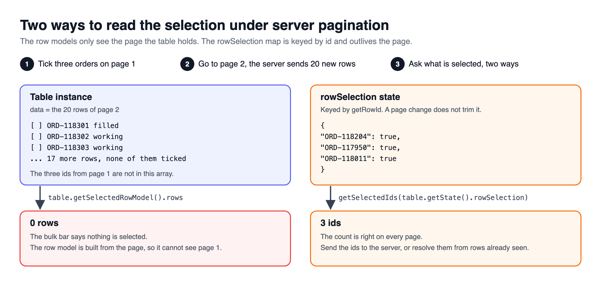
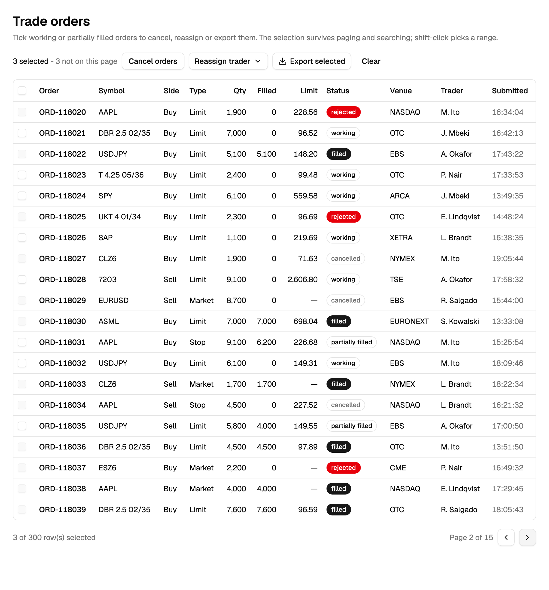

[Part 9](#/docs/row-selection-basics) built the checkbox column, id-keyed ticks, rows you cannot tick and the bulk action bar; this part keeps those ticks honest beyond one page.

## The big picture

> [!TERMS]
>
> - **Row id** - a value that names a row forever, like an order number. Unlike its position, it never changes.
> - **Tick list** - TanStack's `rowSelection` state, a map like `{ "ORD-118204": true }`.
> - **Server pagination** - the browser only ever holds the current page; the server has the rest.
> - **Bulk action** - one button that acts on every ticked row: cancel, reassign, export.
> - **React Compiler** - a build tool that adds memo-style caching to your components automatically.
> - **Memoisation** - reusing a previous result when the inputs look the same, instead of computing it again.

> [!TLDR]
> Once ticks are stored by id, they can outlive the page they were made on.
> The work now is counting them honestly, deciding when to drop them, and not letting a build tool freeze the count.

> [!ANALOGY]
> The tick list is your shopping list; the current page is one aisle.
> Walking to another aisle does not empty your list, so never count your items by looking at the shelf in front of you.

Table: each row is a bug from this part, when you would notice it, and the fix.

| Problem                               | When you notice it                 | Fix                                          |
| ------------------------------------- | ---------------------------------- | -------------------------------------------- |
| The count resets on page 2            | Server pagination                  | Count from the tick list, not the page       |
| Ticks hidden by a search              | Searching after ticking            | Say how many ticks are not on this page      |
| Export returns fewer rows than ticked | Ticks made under an earlier search | Export by ids and ignore the current search  |
| The bar is stuck on "0 selected"      | After turning on React Compiler    | Opt that component out, or pass plain values |

> [!RECAP]
>
> - The tick list is the truth; the current page is only a view.
> - Every bug here is something reading the page when it should read the list.

## Ticks across pages

> [!TLDR]
> When the server does the paging, the table only holds the current page.
> TanStack's "selected rows" helper can only see that page, so count from the tick list itself.



> [!THINK]
> The tick list is a map of id to `true` or `false`.
> What is the smallest function that turns it into "the ids that are ticked", with no reference to the page?

```ts title="get-selected-ids.ts"
export const getSelectedIds = (selection: RowSelectionState): string[] =>
  Object.keys(selection).filter((id) => selection[id]);

const selectedIds = getSelectedIds(table.getState().rowSelection);
```

A footer that says "3 selected" on page 1 and "0 selected" on page 2 is a very common bug.
It is reading the page, not the tick list.

> [!NUANCE]-
>
> - An id tells you _which_ rows, not _what is in them_. Either send the ids to the server, or remember each row as its page loads.
> - That memory can decide what to **show**, never what is **allowed**. An id you never loaded means "do not offer the action".
> - "Select all 1,204 matching" should send the filter plus the rows to leave out, not 1,204 ids.

> [!RECAP]
>
> - With server paging, count from the tick list, not the selected-rows helper.
> - What you remember about unseen rows can hide actions, never allow them.

## Search, tabs and export

> [!TLDR]
> Keep ticks through a search only if you tell the user how many are now hidden.
> Clear them when the available actions change.
> Export exactly what was ticked.

Keeping ticks through a search supports "search NVDA, tick all, untick two, clear the search".
But the bar must then say "12 selected - 3 not on this page", or a trader sees nine ticks and cancels twelve orders.



> [!STEPS]
>
> 1. **Tabs change the actions.** Moving from the Working tab to the Filled tab changes what can be done, so clear the ticks - inside the tab's click handler, not an effect.
> 2. **Export sends ids.** "Export selected" sends the ids, and the server ignores the current search.
> 3. **Otherwise rows vanish.** A row ticked under an earlier search gets filtered out, and the trader gets eleven rows after ticking twelve.

> [!NUANCE]-
>
> - Shift-click to tick a range: remember the last clicked **id**, not its index, because the index goes stale after a sort.

> [!RECAP]
>
> - Keep ticks through a search only if you say how many are hidden.
> - Clear ticks when the available actions change.
> - Export exactly the ticked rows.

## React Compiler and the stuck "0 selected"

> [!TLDR]
> TanStack keeps one `table` object and changes it in place, so it is always "the same object".
> React Compiler sees the same input and reuses the old drawing forever.
> Opt such components out with `"use no memo"`, or pass them plain values instead.

 because the table object never looks new.")

> [!THINK]
> The compiler skips a re-render when every prop looks the same as last time.
> If the only prop is an object that is changed in place, when does it ever look different?
> What single line could tell the compiler to leave this component alone?

```tsx title="orders-bulk-bar.tsx"
export const OrdersBulkBar = ({ table }: OrdersBulkBarProps) => {
  "use no memo"; // must be the first line: the table object never changes identity

  const count = getSelectedIds(table.getState().rowSelection).length;

  return <BulkBar count={count} />;
};
```

> [!GOTCHA]
> The opt-out works per component, and children in other files do not inherit it.
> After turning the compiler on, one team found every search box refused typing and every footer read "0-0 of 0" above visible rows.
> The toolbar and footer each received the unchanging `table` object.
> Every component that reads live values from `table` needs its own `"use no memo"`.

> [!INTERVIEW]-
>
> - _What is the cleaner long-term fix?_ Pass plain values like `selectedIds` and `onClear`. They change when the ticks change, so the compiler caches correctly, and only the one parent reading `table` needs the opt-out.

> [!WIN]-
> Honest counts on every page, ticks that survive a search without hiding anything, exports that match the ticks, and a bar that survives a compiler upgrade.

> [!RECAP]
>
> - React Compiler caches components that receive the unchanging table object.
> - Opt each such component out with "use no memo", or pass plain values.

## Summary

> [!SUMMARY]
>
> - Under server paging, read the tick list itself for counts and actions.
> - Memory of unseen rows can hide an action, never allow one; "select all matching" sends a filter plus exclusions.
> - Keep ticks through a search only with an honest "not on this page" count; clear them when the tab changes the actions.
> - Export by ids and ignore the current search.
> - With React Compiler, opt every component that reads the table out, or pass plain values.

```quiz
[
  {
    "q": "Under server pagination, a trader ticks 3 orders on page 1 and moves to page 2. The footer says 0 selected. What is it reading?",
    "options": [
      "table.getState().rowSelection",
      "The seen-rows id-to-row cache",
      "table.getFilteredSelectedRowModel()",
      "The rowSelection prop from the URL seed"
    ],
    "answer": 2,
    "expl": "Selected row models are built from rows the table holds, which is one page. The id-keyed state map is the cross-page truth, so reading it would still say 3."
  },
  {
    "q": "The bar uses a cache of rows seen on earlier pages to decide whether to offer Cancel. What is that cache allowed to decide?",
    "options": [
      "Whether the server should accept the cancel",
      "Whether to show the action at all",
      "Which rows the server will cancel",
      "Whether to skip the confirm dialog"
    ],
    "answer": 1,
    "expl": "The cache is only as fresh as the last page load, so it can hide an action but never authorize one. The server re-checks."
  },
  {
    "q": "How should 'Select all 1,204 matching' be sent to the server?",
    "options": [
      "As the filter plus a list of excluded ids",
      "As 1,204 ids in a form POST body",
      "As page numbers the user has visited",
      "As a CSV of ids built on the client"
    ],
    "answer": 0,
    "expl": "The client never holds all matching rows, so it cannot list their ids. Sending the filter and exceptions lets the server resolve the set itself."
  },
  {
    "q": "Which are sound choices for selection and search? Select all that apply.",
    "options": [
      "Keep ticks through a search and show how many are hidden",
      "Clear ticks when switching to a tab with different actions",
      "Keep ticks through a search without mentioning hidden rows",
      "Clear ticks in an effect that watches the search query"
    ],
    "answer": [0, 1],
    "multi": true,
    "expl": "Keeping ticks is fine only if hidden ones are disclosed, and a tab change invalidates the actions. Clearing belongs in the event handler, which knows the user caused it."
  },
  {
    "q": "A trader ticked 12 orders across two searches and clicks Export selected, but gets 11 rows. What did the CSV route do?",
    "options": [
      "It paginated the export to the current page size",
      "It dropped ids that were not in the seen cache",
      "It scoped the ids to the caller's desks",
      "It applied the current filter to the selected ids"
    ],
    "answer": 3,
    "expl": "One id was ticked under an earlier search, so today's filter excludes it. With ids present, the export should ignore filters but keep the caller's scope."
  },
  {
    "q": "After enabling React Compiler, the bulk bar stays at '0 selected'. It receives the TanStack table as a prop. Why?",
    "options": [
      "The compiler strips useState calls from children",
      "rowSelection is not reactive under the compiler",
      "The table reference never changes, so cached output is reused",
      "The compiler moves the bar outside the table context"
    ],
    "answer": 2,
    "expl": "TanStack mutates one table object in place. The compiler sees an identical input and returns the memoized render; rowSelection itself still updates fine."
  },
  {
    "q": "Which make a bulk bar robust under React Compiler? Select all that apply.",
    "options": [
      "Passing selectedIds and onClear as primitive props",
      "Putting 'use no memo' on each component reading table",
      "Wrapping the bar in React.memo with no comparator",
      "Storing the table object in a useRef inside the bar"
    ],
    "answer": [0, 1],
    "multi": true,
    "expl": "Primitive props change with the selection, and the opt-out disables caching for components reading the mutable table. memo and refs both keep the stale result."
  },
  {
    "q": "Shift-click range selection stores the index of the last clicked row. What breaks?",
    "options": [
      "The range includes disabled rows",
      "A sort makes the index stale",
      "Ctrl-click stops toggling single rows",
      "The header checkbox shows indeterminate"
    ],
    "answer": 1,
    "expl": "An index goes stale on any sort or page change. Store the id and resolve its position in the visible row model at click time."
  }
]
```

```related
[
  {
    "title": "Row selection guide",
    "url": "https://tanstack.com/table/v8/docs/guide/row-selection",
    "source": "TanStack Table docs",
    "kind": "read",
    "note": "rowSelection state and why the selected row models only see loaded rows."
  },
  {
    "title": "React Compiler",
    "url": "https://react.dev/learn/react-compiler",
    "source": "React docs",
    "kind": "read",
    "note": "What the compiler memoises, and how \"use no memo\" opts a component out."
  },
  {
    "title": "Data Table III",
    "url": "https://www.greatfrontend.com/questions/user-interface/data-table-iii",
    "source": "GreatFrontEnd",
    "kind": "practice",
    "difficulty": "Hard",
    "note": "Add a checkbox column and make ticks survive sorting and paging."
  }
]
```
