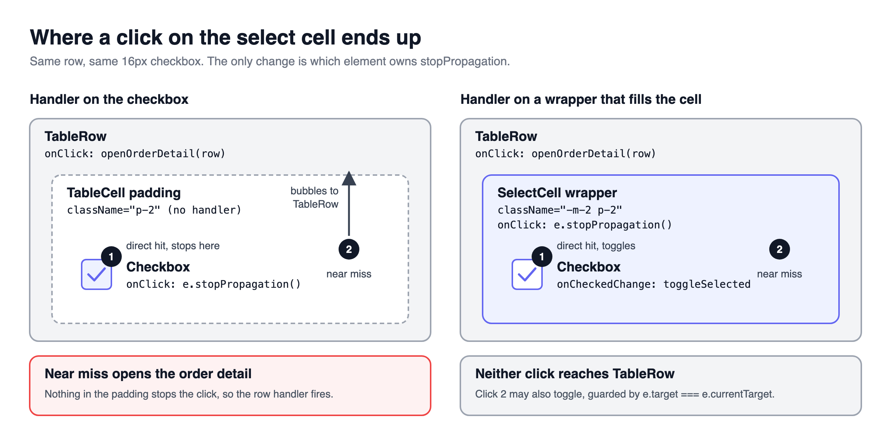
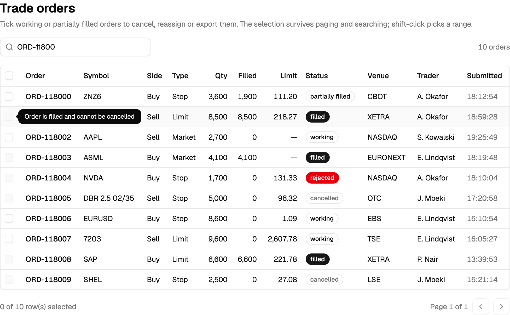
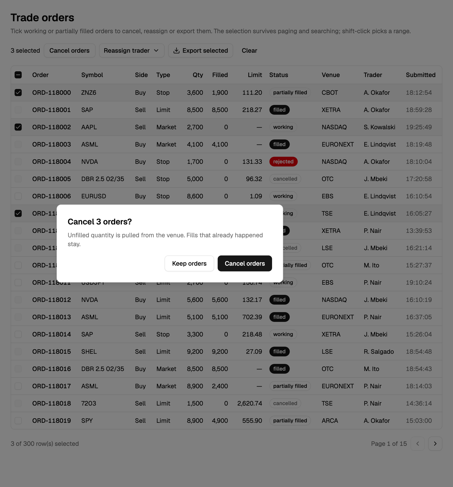

## The big picture

> [!TERMS]
>
> - **Row selection** - ticking checkboxes to pick rows for a bulk action.
> - **Row id** - a value that names a row forever, like an order number. Unlike its position, it never changes.
> - **Bulk action** - one button that acts on every ticked row: cancel, reassign, export.
> - **Bubbling** - a click on an inner element also reaches every element around it, unless something stops it.
> - **Controlled state** - state you hold yourself and hand to a component, instead of letting it keep its own.

> [!TLDR]
> A checkbox column takes ten minutes.
> Making the ticks stick to the right rows, and the actions honest, is the real work.

> [!ANALOGY]
> Ticking rows is like putting sticky notes on paper files.
> Stick the note on the file itself and it stays put when someone reshuffles the pile.
> Write "third file from the top" on a notepad instead, and one reshuffle points you at the wrong file.

Our example is the trade orders table from earlier in the series.
Traders want to tick rows and press "Cancel orders", "Reassign trader" or "Export selected".
Only orders that are still `working` or `partially_filled` can be cancelled - and that one rule shapes half the design.

Table: each row is a selection bug, when you would notice it, and the fix covered below.

| Problem                              | When you notice it                      | Fix                                         |
| ------------------------------------ | --------------------------------------- | ------------------------------------------- |
| Missing the checkbox opens the row   | Tables where a row click does something | Make the whole cell swallow the click       |
| The tick jumps to another row        | After a sort, refresh or page change    | Give TanStack the real row id               |
| "Why can't I tick this one?"         | Rows that cannot be acted on            | Greyed checkbox plus a tooltip saying why   |
| An action fails for some ticked rows | Mixed or stale selections               | Offer only actions that work for every tick |

> [!RECAP]
>
> - Remember ticks by the row id, not its position.
> - Most selection bugs appear after a sort, a refresh or a page change.

## The checkbox column, and a bigger target

> [!TLDR]
> The checkbox sits inside a wrapper that fills the whole cell and stops the click there.
> A near miss then does nothing, instead of opening the order.



A 16px checkbox inside a clickable row is a trap.
Miss it by two pixels and the click lands on the cell's padding, bubbles up to the row, and opens the order.

> [!THINK]
> Where does a click in the cell's padding go, if the checkbox never sees it?
> So which element should stop the click: the checkbox, or something around it?

```tsx title="select-cell.tsx"
export const SelectCell = ({ row }: SelectCellProps) => (
  <div className="-m-2 p-2" onClick={(e) => e.stopPropagation()}>
    <Checkbox
      checked={row.getIsSelected()}
      disabled={!row.getCanSelect()}
      onCheckedChange={(v) => row.toggleSelected(!!v)}
      aria-label={`Select order ${row.original.id}`}
    />
  </div>
);
```

> [!NUANCE]-
>
> - The click-stopper belongs on the **wrapper**. A click in the padding never touches the checkbox, so a handler on the checkbox never runs.
> - `-m-2 p-2` pulls the wrapper out to the cell's edges and puts the spacing back inside it.
> - Name the order in each label, so a screen reader says "Select order ORD-118204", not "checkbox, checkbox, checkbox".
> - Fix the column at 40px and switch off sorting and hiding for it.

> [!RECAP]
>
> - Wrap the checkbox in a cell-filling element that stops the click.
> - Name the row in each checkbox label for screen readers.

## Remember ticks by id, not position

> [!TLDR]
> TanStack stores ticks as a list like `{ "row-id": true }`.
> If you do not tell it the real id, it uses the row's position - and a position points at a different order after every sort.

> [!ANALOGY]
> It is like remembering a person as "whoever sits in seat 3".
> The moment people change seats, you are talking to someone else.

> [!STEPS]
>
> 1. **You tick the first row, order ORD-118204.** TanStack stores `{ "0": true }` - "row 0 is ticked".
> 2. **You sort by symbol.** The server sends a new list; row 0 is now ORD-117950.
> 3. **Nothing updated the ticks.** So ORD-117950 now shows as ticked.
> 4. **You press "Cancel orders".** You cancel an order nobody chose.

The fix is one line: `getRowId: (row) => row.id`.
Now the tick list says `{ "ORD-118204": true }`, which means the same order under every sort and every refresh.

> [!INTERVIEW]-
>
> - _When do you hold the tick list yourself (controlled state)?_ When something outside the table needs it, like a side panel or ticks loaded from the URL.
> - _Does every list need TanStack for this?_ No. For a simple list, a small hook around a JavaScript `Set` of ids is simpler.

> [!RECAP]
>
> - Without getRowId, a tick follows whatever row is now in that position.
> - Hold the tick list yourself only when something outside the table needs it.

## Rows you cannot tick

> [!TLDR]
> Tell TanStack which rows may be ticked.
> A refused row must look refused and say why: a greyed checkbox plus a tooltip.

> [!THINK]
> The table and the bulk bar both need the "can this order be cancelled?" rule.
> Where should that rule live so the two never disagree?

```ts title="is-cancellable.ts"
export const isCancellable = (order: TradeOrder): boolean =>
  order.status === "working" || order.status === "partially_filled";

useReactTable({ enableRowSelection: (row) => isCancellable(row.original) });
```

> [!NUANCE]-
>
> - Keep the rule in its own file, because the bulk action bar needs it too.
> - The "tick all" checkbox in the header only counts rows that can be ticked.

> [!GOTCHA]
> A disabled button ignores the mouse completely, so a tooltip placed on it never opens.
> Put the tooltip on a `span` wrapped around it.



> [!RECAP]
>
> - enableRowSelection decides which rows can be ticked.
> - A refused row shows a greyed checkbox and a tooltip on a wrapping span.

## The bulk action bar

> [!TLDR]
> Only show an action if it works for **every** ticked row.
> Ask before doing anything destructive, and only clear the ticks once the action succeeded.

> [!STEPS]
>
> 1. **Check again in the bar.** Prices move: an order can fill after you ticked it, and TanStack never removes a tick by itself.
> 2. **Confirm destructive actions.** Label the "never mind" button "Keep orders". Next to "Cancel orders", a button called "Cancel" is a coin flip.
> 3. **Clear the ticks only on success.** If the request fails, the ticks stay, so the trader can retry without re-ticking twelve rows.
> 4. **Refresh the list** so cancelled orders reappear with their new status.
> 5. **Let the server check too.** The check in the browser is a courtesy; the server's check is the real guard.



> [!NUANCE]-
>
> - A button that quietly skips some of the ticked rows is worse than no button.
> - The bar swaps in for the search box in a slot of fixed height. If it pushed the table down, the trader's next click would land on a different row.

> [!WIN]-
> Ticks tied to real ids, a checkbox you cannot miss, refused rows that explain themselves, and a bar that never lies about what it will do.

> [!RECAP]
>
> - Show an action only when it works for every ticked row.
> - Confirm destructive actions, and clear ticks only after success.
> - The server re-checks; the browser check is a courtesy.

## Summary

> [!SUMMARY]
>
> - Make the whole cell the checkbox target, so a near miss never opens the row.
> - Pass getRowId so every tick belongs to a real row, not a position.
> - Decide tickable rows with enableRowSelection, and explain refused rows with a tooltip.
> - Only offer actions that work for every ticked row; confirm, and clear ticks only on success.
> - Next part: keeping ticks honest across pages, searches and a React Compiler upgrade.

```quiz
[
  {
    "q": "A trader ticks an order, the blotter refetches after 30 seconds, and a different order is now ticked. What is missing?",
    "options": [
      "autoResetRowSelection set to false",
      "getRowId returning the order id",
      "A controlled rowSelection state",
      "A stable key on each rendered row"
    ],
    "answer": 1,
    "expl": "Without getRowId the selection map is keyed by index, so a new data array moves the tick to whatever row is now at that index. A React key only fixes DOM reuse, not the tick list."
  },
  {
    "q": "Users keep opening the order drawer when they mean to tick a checkbox. stopPropagation is on the Checkbox's onClick. Why does it still happen?",
    "options": [
      "Radix checkboxes re-dispatch the click event",
      "stopPropagation does not work on React synthetic events",
      "The row handler runs in the capture phase first",
      "Near misses hit padding, not the checkbox"
    ],
    "answer": 3,
    "expl": "A click in the padding never reaches the checkbox, so its handler never runs and the click bubbles to the row. The wrapper that fills the cell must stop it."
  },
  {
    "q": "A disabled checkbox has a Tooltip explaining why, but the tooltip never appears. Fix?",
    "options": [
      "Put the tooltip on a wrapping span",
      "Set pointer-events: auto on the checkbox",
      "Replace disabled with aria-disabled only",
      "Add tabIndex={0} to the disabled checkbox"
    ],
    "answer": 0,
    "expl": "Disabled buttons fire no pointer or focus events, so the tooltip trigger never activates. A wrapping span receives them instead; tabIndex alone does not bring pointer events back."
  },
  {
    "q": "Only cancellable rows can be ticked. Why does the bulk bar still re-check every selected row before showing Cancel?",
    "options": [
      "The header checkbox can select disabled rows",
      "React batches updates and may skip the check",
      "An order can fill after it was ticked",
      "Selection state is shared across tabs"
    ],
    "answer": 2,
    "expl": "The data is live and TanStack never removes an id from rowSelection by itself, so a ticked row can become ineligible. The header checkbox already respects enableRowSelection."
  },
  {
    "q": "A cancel mutation fails with a 500. What should happen to the selection?",
    "options": [
      "Clear it so the user sees fresh data",
      "Keep only rows that are still cancellable",
      "Reset it to the initial seeded state",
      "Keep it so the trader can retry"
    ],
    "answer": 3,
    "expl": "Clearing on failure forces the trader to re-tick every row. Clear only on success, then refresh the list."
  },
  {
    "q": "The confirm dialog for 'Cancel orders' has buttons 'Cancel' and 'Confirm'. What is the problem?",
    "options": [
      "Destructive dialogs should not have a dismiss button",
      "Confirm should be styled as the destructive variant",
      "Cancel is ambiguous next to an action about cancelling",
      "The dialog should list every order id first"
    ],
    "answer": 2,
    "expl": "'Cancel' could mean cancel the orders or cancel the dialog. 'Keep orders' makes the dismiss unambiguous; styling alone does not fix the wording."
  },
  {
    "q": "A teammate proposes a Reassign button that silently skips ticked orders the trader cannot reassign. Which are sound responses? Select all that apply.",
    "options": [
      "Show the button only when every ticked row allows it",
      "Keep the eligibility rule in one shared function",
      "Skipping is fine as long as a toast appears afterwards",
      "Trust the browser check and skip the server check"
    ],
    "answer": [0, 1],
    "multi": true,
    "expl": "An action should work for every ticked row, and one shared rule keeps the table and bar in agreement. A toast after the fact still acted on a set the trader did not expect, and the server must always re-check."
  }
]
```

```related
[
  {
    "title": "Row selection guide",
    "url": "https://tanstack.com/table/v8/docs/guide/row-selection",
    "source": "TanStack Table docs",
    "kind": "read",
    "note": "rowSelection state, getRowId, enableRowSelection and the selected row models."
  },
  {
    "title": "Transfer List",
    "url": "https://www.greatfrontend.com/questions/user-interface/transfer-list",
    "source": "GreatFrontEnd",
    "kind": "practice",
    "note": "Checkbox selection that moves items between lists - the same id-keyed thinking."
  },
  {
    "title": "Data Table III",
    "url": "https://www.greatfrontend.com/questions/user-interface/data-table-iii",
    "source": "GreatFrontEnd",
    "kind": "practice",
    "difficulty": "Hard",
    "note": "Add a checkbox column and make ticks survive sorting and paging."
  }
]
```
