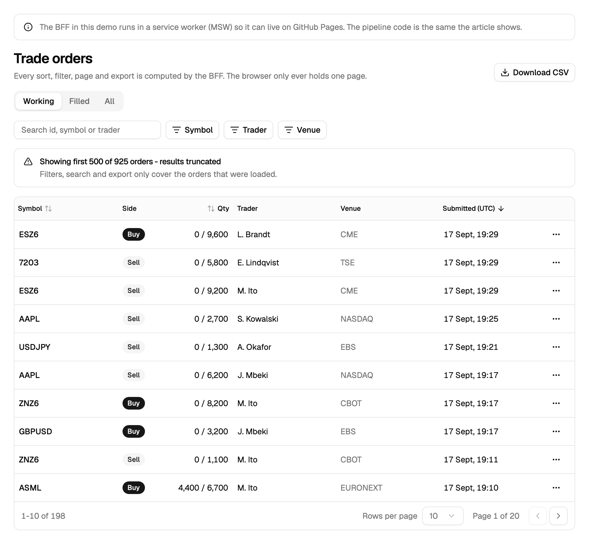
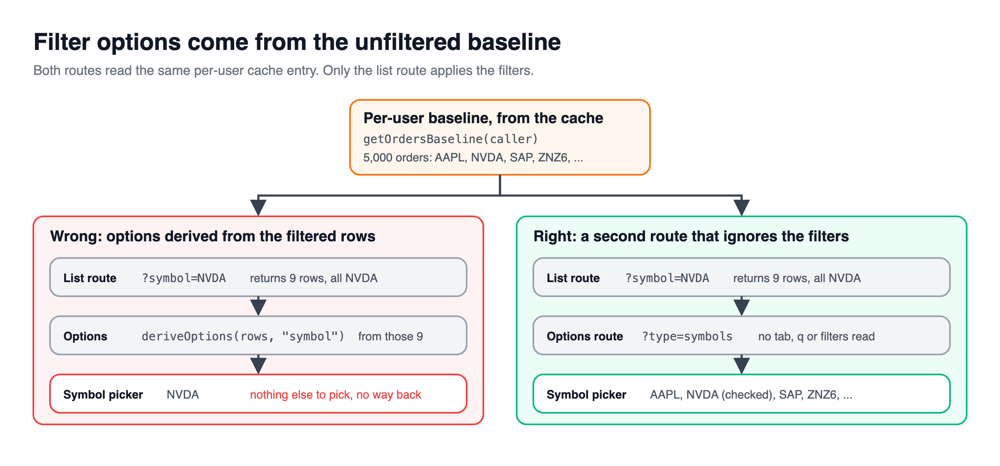
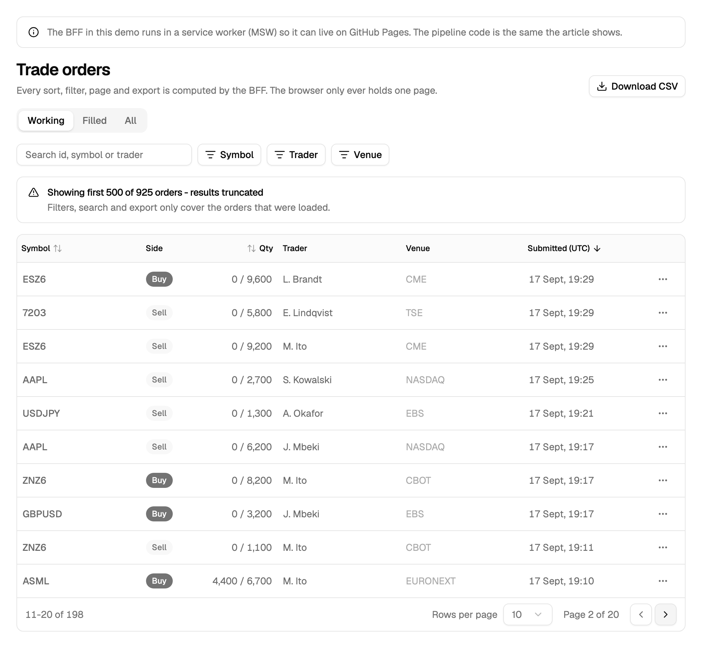

> [!TERMS]
>
> - **BFF (backend for frontend)** - a small server that sits between the browser and the real API, shaped around what one screen needs.
> - **Schema (zod)** - a written-down shape for data, checked at runtime, so bad data fails loudly.
> - **Version skew** - a newly deployed server talking to an older page still open in someone's tab.
> - **Manual mode** - TanStack's flags that say "the server already sorted, filtered and paged these rows".
> - **React Query** - a library that fetches, caches and refetches data for you.
> - **Debounce** - waiting until the user stops typing for a moment before acting.
> - **SSR (server-side rendering)** - building the first HTML on the server so the page arrives with content already in it.
> - **Hydration** - React in the browser attaching itself to that server HTML. Both sides must produce identical HTML.

## The big picture

[Part 3](#/docs/server-tables-request-pipeline) built the server side: six steps per request, a pure compute file and a per-user cache.

> [!TLDR]
> The server now owns filtering, sorting and paging.
> The browser's job shrinks to four things: trust the response shape, keep every choice in the URL, tell TanStack to keep its hands off the rows, and never let a failed request look like an empty table.

Table: each row is a job the browser still has, now that the server does the heavy lifting.

| Browser's job             | Why it still matters                                                            |
| ------------------------- | ------------------------------------------------------------------------------- |
| Check the response shape  | A newer server can ship a shape an older open tab does not expect               |
| Read and write the URL    | A bookmarked or pasted link has to reproduce the exact same view                |
| Tell TanStack "hands off" | Without the manual flags it re-sorts and re-pages the one page it already holds |
| Fail loudly               | A broken request and an empty result must never look the same on screen         |

> [!ANALOGY]
> Part 3 built the kitchen: it decides what goes on the plate.
> This part is the waiter: it does not cook anything, but it still has to carry the right plate to the right table, in the order the kitchen sent it out, and say so loudly if a plate never arrives.

> [!NUANCE]-
> The browser is not a dumb pipe.
> It still owns real state: which sort, which page, which text is in the search box.
> The difference from part 1 is that none of that state decides _which rows exist_ anymore - only which of the server's rows are on screen right now.

> [!RECAP]
>
> - Part 3's BFF now owns sorting, filtering and paging.
> - The browser's remaining job: trust the shape, own the URL, defer to the server, and fail loudly.

## One shape, checked on both ends

> [!TLDR]
> Describe the response once with a zod schema.
> The server checks its answer before sending it, and the browser checks it again on arrival.

> [!ANALOGY]
> The schema is a packing list taped to the box.
> The warehouse checks it before shipping, and you check it again at the door, because a box can be packed by a newer warehouse than the one you ordered from.

The server-side check catches bugs in `compute.ts`, where the server logs are.
The browser-side check catches version skew: it fails at the door instead of showing `undefined` in a cell.

> [!NUANCE]-
>
> - The URL's query parameters get a schema too, with every default written in, so an empty URL means "the default view".
> - An unknown tab is an error (400), because falling back would show the wrong rows under the right heading.
>   A junk filter value just means "no filter", which the user can see.
> - One function builds query strings for the list, the export link and the page URL, so they can never disagree.

> [!RECAP]
>
> - One zod schema, checked on the server before sending and in the browser on arrival.
> - Unknown tabs are errors; junk filter values just mean no filter.

## Manual mode and the URL

> [!TLDR]
> The browser shows rows it did not sort, filter or page itself, so you tell TanStack "the server already did this".
> Everything the user chose lives in the URL, so a view can be bookmarked or pasted to a colleague.

> [!STEPS]
>
> 1. **Fetch with React Query.** Keep the old rows visible while the next page loads.
> 2. **Throw on errors.** Never turn a failed request into an empty list - an empty table says "no orders", which hides the outage.
> 3. **Read sort and page from the URL.** Any change that is not a page change goes back to page 1.
> 4. **Debounce the search box into the URL**, so every keystroke does not become a new request.
> 5. **Turn on `manualSorting`, `manualFiltering` and `manualPagination`.** Without them TanStack re-sorts the one page it holds as if it were everything.

> [!THINK]
> Which three flags tell TanStack to keep its hands off the rows?
> What does it need from you instead, so the footer can say "Page 1 of 20"?
> What should "no rows yet" be, so TanStack does not think the data changed every render?

```tsx title="use-orders-table.ts"
const EMPTY: Order[] = [];

const table = useReactTable({
  data: query.data?.rows ?? EMPTY,
  columns,
  manualSorting: true,
  manualFiltering: true,
  manualPagination: true,
  rowCount: query.data?.total ?? 0,
  state: { sorting, pagination },
  getCoreRowModel: getCoreRowModel(),
});
```

> [!NUANCE]-
>
> - Only allow sorts the server understands, by checking the column id against the server's list.
> - Use a constant empty array for "no rows yet". A bare `?? []` makes a new array every render, and TanStack treats that as new data.



> [!RECAP]
>
> - Tell TanStack the server already sorted, filtered and paged (the manual flags).
> - Keep every choice in the URL so views can be shared.
> - Never turn a failed request into an empty list.

## Dropdown options, and reusable columns

> [!TLDR]
> The filter dropdowns get their options from a separate route that looks at **all** of the user's data, not the filtered page.
> Columns are small functions you mix and match per tab.



Look at the left side of that picture.
If the dropdown's options came from the filtered rows, picking "NVDA" would leave only "NVDA" in the list.
You could never pick a second symbol.

> [!NUANCE]-
>
> - Options load only when a dropdown is first opened, then stay cached for the visit.
> - Sort options "naturally" so `ZNZ6` comes before `ZNZ26`.
> - Keep column labels and widths in a plain config file, so the CSV export can reuse the same labels.
> - Build the columns inside `useMemo` keyed by the tab, so switching unrelated state does not rebuild them.

> [!GOTCHA]
> JavaScript's `{ ...a, meta: {...} }` replaces `meta` completely rather than merging it.
> Spread the old meta back in (`meta: { ...colMeta(id), numeric: true }`), or the labels vanish, and so do the CSV headers.

> [!RECAP]
>
> - Dropdown options come from all of the user's data, not the filtered page.
> - Object spread replaces nested objects; spread the old meta back in.

## First paint, hydration and CSV

> [!TLDR]
> You can pre-fill the first page on the server, or show placeholders and fetch after load.
> Either way, every cell must print exactly the same text on the server and in the browser.

Table: compare the two ways to show the first page: what you gain and what it costs.

| Choice                 | Good                            | Cost                                                 |
| ---------------------- | ------------------------------- | ---------------------------------------------------- |
| Pre-fill on the server | Rows are in the very first HTML | Clicking the menu link waits until the data is ready |
| Fetch after load       | The page opens instantly        | The first view is grey placeholder rows              |

> [!NUANCE]-
>
> - Pin the time zone, the 12/24-hour clock and the locale in your formatters.
>   Otherwise the server formats "14:31" in its zone and the browser in the user's, and React complains the HTML does not match.
> - Never compute "2 hours ago" from the current time while drawing. The server sends an `asOf` time instead.
> - Create React Query's client inside the component, never as a shared module variable, or users share a cache.
> - The CSV route runs the same pipeline without paging. With selected ids it exports exactly those, still limited to the user's desks.
> - While the next page loads, dim the old rows and mark the table busy for screen readers.

> [!WIN]
> One pipeline, three routes, no drift: the table, the dropdowns and the export always agree.



> [!RECAP]
>
> - Pre-fill on the server only where people land cold on a list.
> - Pin time zone, clock and locale so server and browser print the same text.
> - CSV reuses the pipeline without paging, and never exports more than the view.

## Summary

> [!SUMMARY]
>
> - One zod schema checks the data on both ends; one serializer builds every URL.
> - Turn on the manual flags and keep every view choice in the URL.
> - Filter options come from all of the user's data; spread nested meta, never replace it.
> - Pin formatting so server and browser agree, and keep the export identical to the view.

```quiz
[
  {
    "q": "The Symbol filter dropdown only ever lists the symbol already selected. How are its options being produced?",
    "options": [
      "From the rows after the current filters were applied",
      "From a cached copy of the first visible page",
      "From a stale React Query entry with staleTime Infinity",
      "From a column filter with filterFn set to equals"
    ],
    "answer": 0,
    "expl": "Options derived from filtered rows collapse to what is already picked. A separate route reads the unfiltered baseline so every value stays selectable."
  },
  {
    "q": "A server-driven table sorts correctly on page 1 but pages 2 and 3 look sorted only within themselves. What was missed?",
    "options": [
      "The sort column lacked a sortingFn",
      "manualSorting was not set on the table",
      "The BFF clamps the page parameter",
      "getSortedRowModel was listed after pagination"
    ],
    "answer": 1,
    "expl": "Without manualSorting TanStack re-sorts the one page it holds. The flags tell it the rows arrived already processed."
  },
  {
    "q": "A column factory writes { ...colConfig('qty'), meta: { numeric: true } } and the CSV header for Qty is now blank. Why?",
    "options": [
      "CSV routes cannot import from React column files",
      "numeric columns are excluded from CSV labels",
      "Spread is shallow, so the new meta replaced the label",
      "colConfig must be called inside a useMemo"
    ],
    "answer": 2,
    "expl": "The meta key overwrites the spread meta entirely, dropping its label. Re-spread it: meta: { ...colMeta(id), numeric: true }."
  },
  {
    "q": "Every row's timestamp triggers a hydration mismatch warning, but only for users outside London. What is missing from the formatter?",
    "options": [
      "A pinned locale such as en-GB",
      "An hour12 setting for the clock",
      "A suppressHydrationWarning prop",
      "A pinned timeZone such as UTC"
    ],
    "answer": 3,
    "expl": "Without a timeZone the server formats in its zone and the browser in the user's. The mismatch tracks location, which is the tell."
  },
  {
    "q": "Which are true of seeding the first page from the page loader? Select all that apply.",
    "options": [
      "Navigation waits until the upstream data is ready",
      "The loader should call its own BFF route over HTTP",
      "Without shouldRevalidate, sort clicks re-run the loader",
      "The QueryClient can be a shared module singleton"
    ],
    "answer": [0, 2],
    "multi": true,
    "expl": "A seeding loader blocks navigation, and URL-driven view state re-runs loaders unless you opt out. The loader imports functions directly, and a module QueryClient would be shared across users."
  },
  {
    "q": "A user selects 3 rows and clicks Export. The CSV has 3 rows even though filters would match 40. Is that right?",
    "options": [
      "No, exports should always follow the active filters",
      "Yes, an explicit selection is what they asked for",
      "No, selection should be intersected with filters",
      "Yes, but only if all 3 are on the current page"
    ],
    "answer": 1,
    "expl": "With ids, the export is exactly the selection and filters are ignored. Scope still applies, so an id from another desk exports nothing."
  },
  {
    "q": "The BFF fetch throws on a 500 but the hook catches it and returns []. What does the user experience?",
    "options": [
      "A retry prompt with the error message",
      "A spinner that never resolves",
      "An empty table that looks like no data",
      "The previous page's rows kept on screen"
    ],
    "answer": 2,
    "expl": "Swallowing an error into an empty list reads as 'nothing matches' and hides the outage. Throw, expose isError and render an error state with retry."
  },
  {
    "q": "Which does a browser-side zod parse of the BFF response protect against? Select all that apply.",
    "options": [
      "A new server deploy talking to an old open tab",
      "A user editing the URL to see another desk",
      "A renamed field showing undefined in a cell",
      "The browser replaying a cached response"
    ],
    "answer": [0, 2],
    "multi": true,
    "expl": "The browser check catches version skew and the shape changes it causes, failing loudly instead of printing undefined. Scope comes from the token, and HTTP caching is fixed with no-store, not a schema."
  }
]
```

```related
[
  {
    "title": "Client-side vs server-side",
    "url": "https://tanstack.com/table/latest/docs/guide/client-side-vs-server-side",
    "source": "TanStack Table docs",
    "kind": "read",
    "note": "The manual flags and when to hand the work to the server."
  },
  {
    "title": "Data loading",
    "url": "https://reactrouter.com/start/framework/data-loading",
    "source": "React Router docs",
    "kind": "read",
    "note": "Server loaders, and how they feed the first render."
  },
  {
    "title": "Zod",
    "url": "https://zod.dev",
    "source": "zod.dev",
    "kind": "read",
    "note": "The schema library used to check data on both ends."
  },
  {
    "title": "Data Table IV",
    "url": "https://www.greatfrontend.com/questions/user-interface/data-table-iv",
    "source": "GreatFrontEnd",
    "kind": "practice",
    "difficulty": "Hard",
    "note": "Build the full filter, sort, page pipeline with state kept outside the table."
  }
]
```
