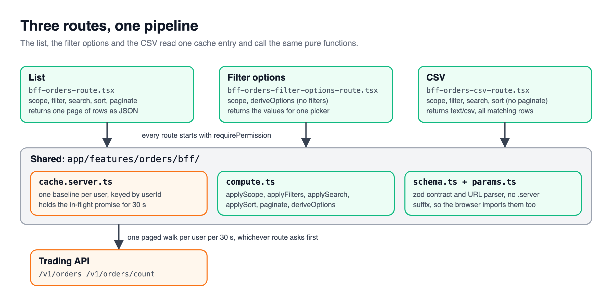
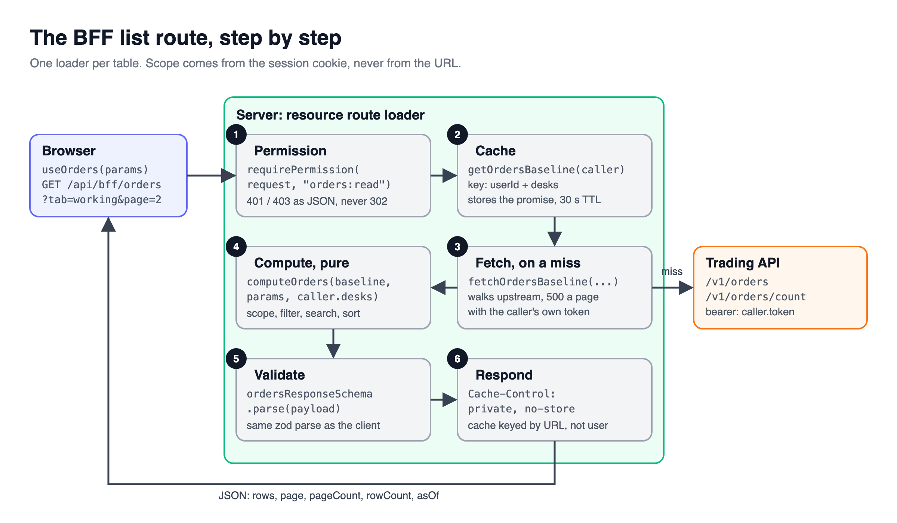

> [!TERMS]
>
> - **Server-driven table** - a table where the server does the filtering, sorting and paging, and the browser only shows one page.
> - **API** - the real backend service that owns the data.
> - **BFF (backend for frontend)** - a small server that sits between the browser and the real API, shaped around what one screen needs.
> - **Route / loader** - in React Router, a URL your app answers; the loader is the function that runs on the server for that URL.
> - **Scope / entitlements** - which rows a particular user is allowed to see.
> - **Pure function** - a function that gives the same output for the same input and touches nothing else.
> - **Cache** - a place to keep a recent answer so you do not have to ask the API again.
> - **Promise** - the "answer is coming" object JavaScript hands you before a slow call finishes.

## The big picture

[Part 2](#/docs/sort-filter-paginate) showed sorting, filtering and paging on the client and on the server with React Query; this part builds the server side properly.

> [!TLDR]
> When the data is too big, or too private, to send to the browser, the table moves to the server.
> Three small routes - the list, the filter options and the CSV export - all run the same logic on the same cached data.

Imagine tens of thousands of trade orders.
And imagine a rule: a trader on the FX desk must **never** receive a Rates order - not even hidden in data they never look at.

Filtering in the browser cannot keep that promise.
If the browser hides a row, the browser already has the row.
So the filtering has to happen before the data leaves the server.

Table: each row is a reason to move a table to the server, and what breaks if it stays in the browser.

| Why move to the server | What goes wrong in the browser                                             |
| ---------------------- | -------------------------------------------------------------------------- |
| Size                   | You cannot ship 50,000 rows on every visit                                 |
| Privacy                | "Hidden" rows have already been downloaded                                 |
| Consistency            | The table, the dropdowns and the export can each end up slightly different |



> [!ANALOGY]
> The real API is a warehouse.
> The BFF is the shop counter in front of it: it checks who you are, fetches only what you are allowed to buy, and hands it over neatly packed for this one screen.

Here the BFF is not a separate service.
It is a few extra routes inside the same React Router app, sharing the same login cookie and the same TypeScript types.
Files ending in `.server.ts` never get sent to the browser, so secrets stay on the server.

> [!NUANCE]-
> Not every table needs this.
> A small table on a detail page with nothing to compute is fine loading its rows directly and doing the work in the browser, like parts 1 and 2.

> [!RECAP]
>
> - Move the table to the server when data is too big or too private to send whole.
> - A BFF is a few extra routes in the same app: list, filter options and CSV.

## One request, six steps in a fixed order

> [!TLDR]
> Every list request does the same six things, always in the same order: check permission, read the query, get the data, compute the page, check its shape, send it back.



> [!THINK]
> Before you open the code, put the six steps in order yourself.
> Which step must come first so a stranger costs you nothing?
> Where do the user's allowed desks come from, if not the URL?

```tsx title="bff-orders-route.tsx"
export const loader = async ({ request }: Route.LoaderArgs) => {
  const caller = await requirePermission(request, "orders:read"); // 1. who are you?
  const parsed = parseOrdersParams(new URL(request.url).searchParams); // 2. what do you want?

  if (!parsed.success)
    return data(
      { error: "invalid_params" },
      { status: 400, headers: NO_STORE },
    );

  const baseline = await getOrdersBaseline(caller); // 3. get the data (cached)
  const page = computeOrders(baseline, parsed.data, caller.desks); // 4. work out the page
  return data(ordersResponseSchema.parse(page), { headers: NO_STORE }); // 5. check shape, 6. send
};
```

Permission comes first so an unauthorised request costs nothing.
The permission check returns a `Caller`: the user's id, their access token for the real API, and the desks they may see.

> [!NUANCE]-
>
> - There is no `?desk=FX` in the URL anywhere. **The user's allowed desks come from their login token, never from the browser**, because the browser can be edited.
> - When the user is not logged in, a BFF route must answer 401 (not logged in) or 403 (not allowed).
>   If it redirects to the login page instead, `fetch` quietly follows the redirect, receives an HTML page, and then fails to read it as JSON with a confusing error.

> [!INTERVIEW]-
>
> - _Why not accept the desk from the client?_ Anything that decides what a user may see has to come from something they cannot edit: their token.

> [!RECAP]
>
> - Every request: permission, params, data, compute, shape check, response.
> - The user's allowed desks come from their token, never the URL.
> - BFF routes answer 401 or 403 - never a redirect to the login page.

## The pure compute step

> [!TLDR]
> All the table logic lives in one file, `compute.ts`, that only transforms data.
> It never fetches, never reads the clock and never looks at the request, which makes it trivial to test.

A pure function gives the same output for the same input, every time, and touches nothing else.
That is what makes it easy to test: hand it rows, check what comes out.

> [!STEPS]
>
> 1. **Scope.** Keep only rows from the user's desks - even if the API already did.
> 2. **Filter and search.** Apply the tab, the dropdown filters, then the search box.
> 3. **Sort, with a tie-breaker.** When two rows are equal, fall back to the order id, so rows never swap places between pages.
> 4. **Page, with a clamp.** If someone bookmarked page 40 and the list shrank, show the last page instead of nothing.

> [!NUANCE]-
>
> - Re-applying the desk scope looks like duplicate work. Keep it.
>   An API document saying "we support this filter" is not proof the API actually applies it.
>   Re-checking costs a little bandwidth; skipping it can show a trader someone else's orders.
> - Write that rule as the very first unit test, so deleting the scope step fails the build.

> [!RECAP]
>
> - Keep the table logic pure: no fetching, no clock, no request object.
> - Re-apply the user scope yourself, even if the API claims it did.

## The per-user cache

> [!TLDR]
> Keep each user's recent data for about 30 seconds, keyed by their user id.
> The list, the dropdown options and the export then share one trip to the API.

> [!THINK]
> One `Map` on the server serves every user.
> What must the key contain so trader A never gets trader B's rows?
> If three requests land in the same millisecond, how do you make them share one API trip?

```ts title="cache.server.ts"
export const getOrdersBaseline = (caller: Caller) => {
  const key = `${caller.userId}|${[...caller.desks].sort().join(",")}`;
  const hit = cache.get(key);

  if (hit && hit.expiresAt > Date.now()) return hit.promise;

  const promise = fetchOrdersBaseline(caller);
  promise.catch(() => cache.delete(key)); // a failed fetch removes itself, so the next try retries
  cache.set(key, { promise, expiresAt: Date.now() + TTL_MS });

  return promise;
};
```

Notice we store the **promise**, not the finished data.
If three requests arrive a few milliseconds apart, the second and third simply wait on the first one's trip instead of starting their own.

> [!NUANCE]-
>
> - On the server, one `Map` is shared by **every user**. A key without the user id in it hands one trader's orders to the next.
> - The trip to the API uses the user's own token, and it has a ceiling (say 5,000 rows). A loop with no ceiling against someone else's API is an outage waiting for a busy day.
> - Do not count "total orders" from your own capped fetch. A capped fetch once reported a neat 5,000 that looked real. Ask the API for the true total, and show a "this list was cut short" warning.

> [!GOTCHA]
> There is a second cache you never wrote: the browser's own.
> If the BFF answers with `Cache-Control: private, max-age=10`, the browser may replay that answer by URL alone for ten seconds.
> So after one person logs out, the next person to log in on that same laptop can briefly see the previous person's table.
> Send `private, no-store` from every BFF route, and add a test that reads each route file and fails if `max-age` appears.

> [!WIN]-
> Three routes share one trip to the API per user, and no request can widen what its user is allowed to see.

> [!RECAP]
>
> - Cache per user id for about 30 seconds, and cache the promise, not the value.
> - Cap the API walk and read the real total separately.
> - Send private, no-store so the browser never replays one user's data to the next.

## Summary

> [!SUMMARY]
>
> - Move a table behind a BFF when size or privacy means the browser should not hold all the rows.
> - Every request runs the same six steps, with permission first and scope taken from the token.
> - Keep the logic pure and re-apply the user's scope yourself.
> - Cache the promise per user, and forbid the browser from caching BFF answers.
> - [Part 4](#/docs/server-tables-browser-side) picks up in the browser: the shared shape, manual mode and the URL.

```quiz
[
  {
    "q": "A BFF list route reads ?desk=FX from the query string to narrow rows. What is wrong with that?",
    "options": [
      "Query strings are too long for multi-desk scopes",
      "The cache key no longer matches the user id",
      "Desk filtering belongs in the upstream API only",
      "A client can widen its own scope by editing it"
    ],
    "answer": 3,
    "expl": "Anything that limits what a user may see must come from their token. A URL parameter is user-controlled, so it can request another desk's rows."
  },
  {
    "q": "The upstream API spec says it supports a status filter. Should compute.ts still apply that filter itself?",
    "options": [
      "Yes, a documented parameter may be silently ignored",
      "No, duplicating filters wastes server CPU time",
      "No, the upstream result is already authoritative",
      "Only when the response cannot be cached"
    ],
    "answer": 0,
    "expl": "Pushdown is an optimization, not the authority. If the backend ignores the parameter, re-applying it costs bandwidth; skipping it shows wrong rows."
  },
  {
    "q": "After a user logs out and a colleague logs in on the same laptop, the colleague briefly sees the first user's orders. The BFF cache is keyed by userId. Most likely cause?",
    "options": [
      "The server Map kept the previous user's entry",
      "React Query kept the old data in memory across logins",
      "The response set private, max-age and the browser replayed it",
      "The session cookie was not rotated on login"
    ],
    "answer": 2,
    "expl": "The browser HTTP cache is keyed by URL alone, and private only stops shared proxies. A max-age lets the browser serve the old JSON. The server cache was already per user."
  },
  {
    "q": "Why does the per-user cache store a Promise rather than the resolved rows?",
    "options": [
      "Promises serialize more compactly in memory",
      "Concurrent routes share one in-flight upstream call",
      "It lets the cache survive a server restart",
      "Resolved values cannot be evicted by TTL"
    ],
    "answer": 1,
    "expl": "The list, filter-options and CSV routes often arrive milliseconds apart. Caching the promise lets them join the same walk instead of starting three."
  },
  {
    "q": "The dashboard shows exactly 5,000 orders every day. The page walk caps at 5,000 rows. What should the BFF do?",
    "options": [
      "Raise the cap until the number stops being round",
      "Paginate the upstream walk lazily per request",
      "Read the total separately and flag truncation",
      "Hide the count whenever it equals the cap"
    ],
    "answer": 2,
    "expl": "A count from your own capped fetch looks like a real number. A separate count endpoint plus a truncated flag tells the user the filter covers only part of the data."
  },
  {
    "q": "A BFF route's permission guard redirects unauthenticated requests to /login. What does the client see?",
    "options": [
      "A clean 401 it can handle and redirect on",
      "A JSON parse error from the HTML login page",
      "A CORS error blocking the redirected response",
      "An empty array because the body is blank"
    ],
    "answer": 1,
    "expl": "fetch follows the 302, gets the HTML shell with status 200, and res.json() throws an unhelpful parse error. BFF routes should return 401 or 403."
  },
  {
    "q": "Which belong in compute.ts for a server-driven table? Select all that apply.",
    "options": [
      "A tie-breaker on id when sort values are equal",
      "A call to Date.now() to compute order age",
      "Re-applying the caller's desk scope to the rows",
      "Reading the user id from the request cookie"
    ],
    "answer": [0, 2],
    "multi": true,
    "expl": "compute.ts is pure: no clock, no request, no IO. A stable tie-breaker and the scope re-check are pure data transforms; time and cookies belong to the route."
  },
  {
    "q": "A teammate's cache key is just the route path, because 'the data is the same for everyone'. Which risks does that create? Select all that apply.",
    "options": [
      "One trader receives another desk's cached orders",
      "The cache can never expire its entries",
      "A failed fetch is served to every user",
      "Promises can no longer be stored in the Map"
    ],
    "answer": [0, 2],
    "multi": true,
    "expl": "A shared Map keyed without the user id hands whoever fetched first to everyone, including a rejected promise if it is not deleted. Expiry and promise storage work the same either way."
  }
]
```

```related
[
  {
    "title": "Client-side vs server-side",
    "url": "https://tanstack.com/table/latest/docs/guide/client-side-vs-server-side",
    "source": "TanStack Table docs",
    "kind": "read",
    "note": "When to hand sorting, filtering and paging to the server."
  },
  {
    "title": "Resource routes",
    "url": "https://reactrouter.com/how-to/resource-routes",
    "source": "React Router docs",
    "kind": "read",
    "note": "Routes with a loader and no component - the building block of this BFF."
  },
  {
    "title": "Cache-Control",
    "url": "https://developer.mozilla.org/en-US/docs/Web/HTTP/Reference/Headers/Cache-Control",
    "source": "MDN",
    "kind": "read",
    "note": "What private, no-store and max-age really tell the browser."
  },
  {
    "title": "Data Table IV",
    "url": "https://www.greatfrontend.com/questions/user-interface/data-table-iv",
    "source": "GreatFrontEnd",
    "kind": "practice",
    "difficulty": "Hard",
    "note": "Build the full filter, sort, page pipeline - then imagine moving it to a server."
  }
]
```
