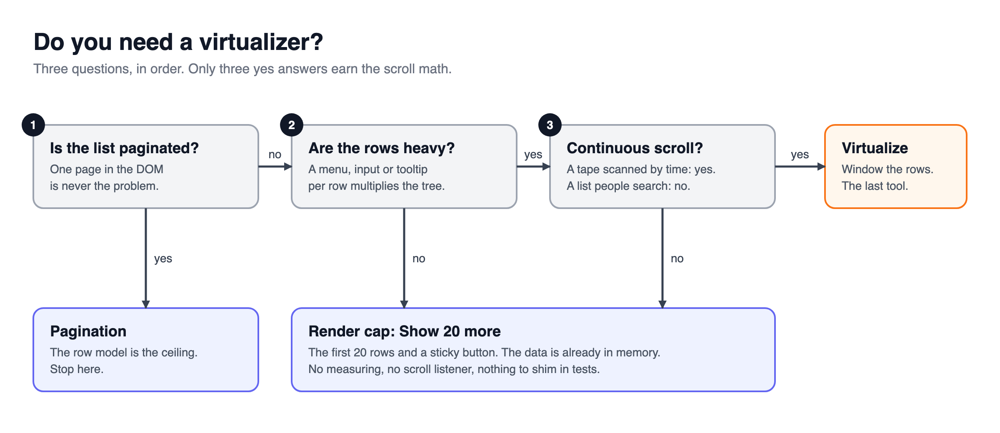
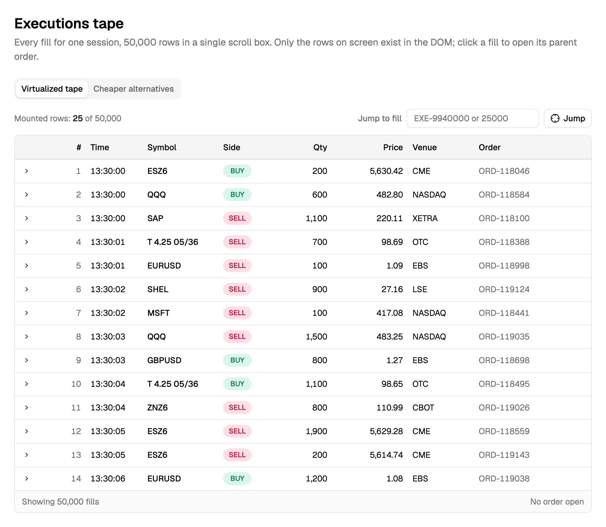
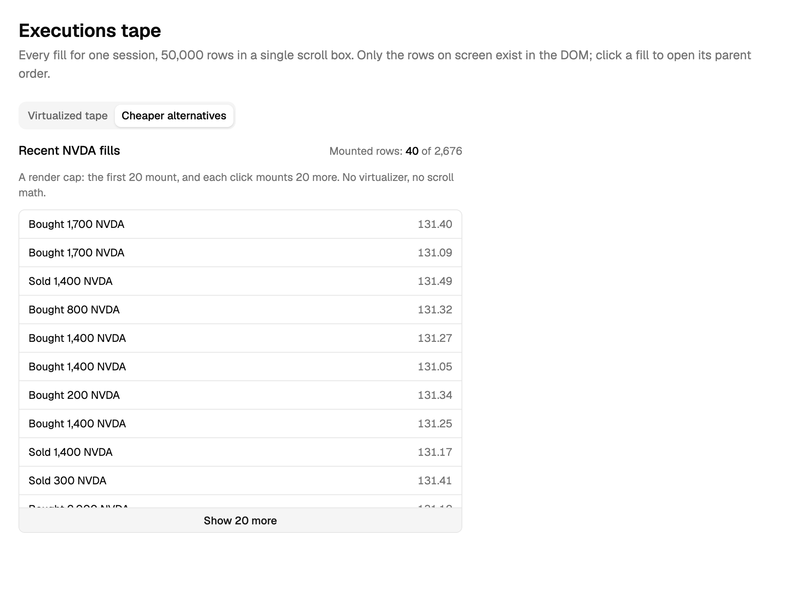

> [!TERMS]
>
> - **DOM** - the live tree of elements the browser keeps for your page. Every `<tr>` is a node in it.
> - **Mounted** - actually present in the DOM right now.
> - **Virtualization (windowing)** - only mounting the rows you can currently see, and faking the rest with empty space.
> - **Render cap** - showing the first N rows with a "Show more" button.
> - **Profiler** - a React component that reports how long its children took to render.
> - **Seeded random generator** - a random number maker that gives the same sequence every time you start it with the same seed.

## The big picture

> [!TLDR]
> Virtualization is the last tool to reach for, not the first.
> This part covers the two moves that fix most slow tables without it: measuring, then paging or capping.

> [!ANALOGY]
> A slow table is like a car that feels sluggish.
> You check the tyre pressure and the handbrake before you rebuild the engine.
> Virtualization is the engine rebuild.

The Executions tape shows every trade fill for one day: 50,000 rows in one scrollable panel, arriving through the day.
The first version put all 50,000 rows in the DOM at once, and the browser tab froze.
That looks like a textbook case for a virtualizer, and it might be, but two cheaper moves come first.

Table: each row is one move in this part, in the order you try it, and what it buys you.

| Move                 | What it buys you                           | When it is not enough                          |
| -------------------- | ------------------------------------------ | ---------------------------------------------- |
| Measure              | Two real numbers instead of a guess        | Numbers alone fix nothing by themselves        |
| Page or cap          | Removes almost every mounted row, for free | The user needs one continuous, un-paged scroll |
| Virtualize (Part 14) | Handles the one case nothing else can      | Real implementation and testing cost           |

Only the third row is expensive, and it is where the next part picks up.
This part stays on the first two, which solve most slow tables outright.

> [!RECAP]
>
> - Reach for a virtualizer last, after measuring and after the cheaper fixes.
> - Measuring, then paging or capping, solves most slow tables on their own.

## When not to virtualize

> [!TLDR]
> Only an un-paged list of heavy rows that people scroll through continuously earns a virtualizer.

Any fill on the tape can expand to show its parent order, so rows are not all the same height either.
Ask three questions before you reach for a virtualizer.



Table: answer each question for your list; any "no" points to a simpler fix than virtualizing.

| Question                                    | If the answer is "no"                       |
| ------------------------------------------- | ------------------------------------------- |
| Is the list un-paged?                       | Page it. Only one page ever reaches the DOM |
| Are the rows heavy (menus, inputs, charts)? | A "Show more" cap is enough                 |
| Does the user need one continuous scroll?   | Page it or cap it                           |

Only three "yes" answers earn a virtualizer.
Plenty of production table systems never virtualize at all, on purpose, because every table pages.

> [!INTERVIEW]-
>
> - _"Would you virtualize this 10,000-row table?"_ Ask first whether it pages, how heavy the rows are, and whether people scroll it end to end. Answering "yes" straight away is the weak answer.

> [!RECAP]
>
> - Virtualize only when the list is un-paged, the rows are heavy, and people scroll it continuously.
> - Any "no" points to paging or a Show more cap instead.

## Measure before you fix

> [!TLDR]
> Get two numbers: how many rows are really in the DOM, and how long a render takes.
> Then decide.

A guess about what is slow is usually wrong.
Numbers stop you from fixing the wrong thing.

> [!STEPS]
>
> 1. **Use the same fake data everywhere.** A seeded random generator makes the server, browser and tests all see the same 50,000 rows.
> 2. **Count real rows** by asking the DOM directly, so nothing can fake the number.
> 3. **Time the render** with React's `Profiler`. It only reports in development builds, so compare numbers, do not quote them.
> 4. **Time the whole interaction** too. React cannot see the browser's layout and paint work.

> [!THINK]
> How would you count the rows that really exist in the page, without trusting your own state?
> Where would you read the render time from?

```tsx title="measure.tsx"
// 1. Count what is really mounted
const mounted = document.querySelectorAll("tbody tr").length;

// 2. Time a render (development builds only)
<Profiler
  id="tape"
  onRender={(_id, phase, actualDuration) => {
    console.log(phase, actualDuration.toFixed(1), "ms");
  }}
>
  <ExecutionsTape />
</Profiler>;
```



> [!NUANCE]-
>
> - A classic trigger: a 500-line list that, when someone picked "All", mounted 500 rows **and 500 dropdown menus** at once.
> - Heavy off-screen DOM slows the whole page, not just scrolling. Twenty heavy pages kept mounted made every layout pass about 12x slower (roughly 40ms instead of 3ms).

> [!RECAP]
>
> - Count real rows in the DOM and time a render before changing anything.
> - Profiler numbers are for comparing, not quoting.
> - Heavy off-screen DOM slows the whole page, not only scrolling.

## The cheaper fixes that usually win

> [!TLDR]
> Keeping 50,000 rows _in memory_ is fine.
> Putting 50,000 `<tr>` elements _in the DOM_ is not.
> Paging and a "Show more" cap both fix the second without any scroll math.

Paging you already know from earlier parts: only one page of rows ever reaches the DOM.
The render cap is even simpler. It keeps a number, and draws that many rows.

> [!THINK]
> What is the smallest piece of state that decides how many rows get drawn?
> Does clicking "Show more" need to fetch anything?

```tsx title="recent-fills.tsx"
const [visibleCount, setVisibleCount] = useState(20);

// draw fills.slice(0, visibleCount), then a button stuck to the bottom of the box:
<Button
  className="sticky bottom-0"
  onClick={() => setVisibleCount((n) => n + 20)}
>
  Show 20 more
</Button>;
```



> [!GOTCHA]
> The trap is thinking the data size is the problem.
> 50,000 objects in an array cost almost nothing.
> 50,000 mounted rows, each with a menu, is what freezes the tab.

> [!NUANCE]-
>
> - The button fetches nothing. It only changes a number.
> - Make it `sticky bottom-0` inside the scroll box, so it is always reachable.
> - Choosing "no virtualizer" for a 455-row feed is a good decision, not a lazy one. Hand-built virtualizers are a known maintenance headache.

> [!WIN]-
> One `useState` and one button took the recent fills panel from 2,676 mounted rows to 20, with no scroll math to maintain.

> [!RECAP]
>
> - Rows in memory are cheap; rows in the DOM are not.
> - A Show more button that just raises a number often wins.
> - Only when paging and a cap both fall short do you virtualize, which is the next part.

## Summary

> [!SUMMARY]
>
> - Ask three questions first: is it un-paged, are rows heavy, is it one continuous scroll.
> - Measure mounted rows and render time before you change anything.
> - Data in memory is cheap; mounted DOM rows are what hurt.
> - Paging or a Show more cap fixes most slow tables with no scroll math.

```quiz
[
  {
    "q": "A paginated table of 50 rows per page feels slow. A teammate proposes adding a virtualizer. Best first response?",
    "options": [
      "Measure first; 50 rows is rarely the DOM problem",
      "Agree, virtualization always reduces render cost",
      "Agree, but only with absolutely positioned rows",
      "Replace pagination with an infinite scroll instead"
    ],
    "answer": 0,
    "expl": "A paginated table already caps mounted rows. The cost is almost certainly elsewhere, so measure mounted rows and render time before adding scroll math."
  },
  {
    "q": "A side panel lists recent fills, usually a few hundred, light rows. What fits best?",
    "options": [
      "A full virtualizer with measured heights",
      "Server-side pagination behind a BFF route",
      "A render cap with a Show 20 more button",
      "Mounting all rows with content-visibility auto"
    ],
    "answer": 2,
    "expl": "Light rows in a bounded panel only need a cap. It adds no scroll math and fetches nothing, while server paging adds a round trip the panel does not need."
  },
  {
    "q": "A teammate says: 'We hold 50,000 fills in a JavaScript array, so the table will always be slow.' What is the accurate pushback?",
    "options": [
      "True, so the array must be split into chunks",
      "Arrays are cheap; mounted DOM rows are the cost",
      "True, unless the array is frozen with Object.freeze",
      "Arrays are cheap only when stored in React Query"
    ],
    "answer": 1,
    "expl": "Holding objects in memory is cheap. The expensive part is turning each one into mounted DOM with menus and inputs, which is what paging, caps and virtualizers all limit."
  },
  {
    "q": "Profiler reports a render of 180ms on your laptop dev build. What is the right way to use that number?",
    "options": [
      "Quote it in the PR as the production render time",
      "Ignore it, since Profiler numbers are meaningless",
      "Divide it by ten to estimate production speed",
      "Compare it against the same build after your fix"
    ],
    "answer": 3,
    "expl": "Development builds are slower and only report in dev, so the absolute value is not the real cost. It is still useful as a before-and-after comparison on the same build."
  },
  {
    "q": "Your render timings look fine, but clicking a row still feels laggy. What could the Profiler be missing?",
    "options": [
      "Browser layout and paint work after React commits",
      "Time React spends inside your component functions",
      "The number of times a component re-rendered",
      "Which phase, mount or update, the render was in"
    ],
    "answer": 0,
    "expl": "Profiler only sees React's own work. Layout and paint happen in the browser afterwards, so you also time the whole interaction; the other options are things Profiler does report."
  },
  {
    "q": "Which situations point to something simpler than a virtualizer? Select all that apply.",
    "options": [
      "The list already pages at 50 rows",
      "Rows are plain text with no menus or inputs",
      "Traders scroll one unbroken day of 50,000 heavy rows",
      "The table has a sticky header row"
    ],
    "answer": [
      0,
      1
    ],
    "multi": true,
    "expl": "A paged list or light rows each answer 'no' to one of the three questions, so paging or a cap is enough. An unbroken scroll of heavy rows is the case that earns a virtualizer, and a sticky header says nothing either way."
  },
  {
    "q": "A 'Show 20 more' button on the recent fills panel calls the BFF for the next 20 rows on every click, even though all 2,676 fills already loaded once. What is wrong with that?",
    "options": [
      "It's fine, always fetch fresh data on click",
      "It should virtualize instead of showing a cap",
      "It refetches data that's already in memory",
      "It should switch to real pagination instead"
    ],
    "answer": 2,
    "expl": "A render cap only needs to reveal more of an array that is already in memory, so refetching wastes a round trip for data you already have. Real pagination is a fine design when the whole list is not preloaded, but that is not the case here."
  },
  {
    "q": "A compliance log lists 1,200 trade corrections, no filters, un-paged, and staff scroll the whole thing top to bottom during an audit. Rows are plain text. Does it need a virtualizer?",
    "options": [
      "Yes, the list is un-paged and scrolled continuously",
      "Yes, 1,200 rows always need more than a cap",
      "No, 1,200 rows always fit on just one page",
      "No, two yes answers are still not enough here"
    ],
    "answer": 3,
    "expl": "Two of the three questions point toward virtualizing: the list is un-paged and read continuously. But the rows are plain text, not heavy, so the third question answers no, and a render cap or paging alone likely solves this instead."
  }
]
```

```related
[
  {
    "title": "Profiler",
    "url": "https://react.dev/reference/react/Profiler",
    "source": "React docs",
    "kind": "read",
    "note": "The component used here to time renders, and why it only reports in development."
  },
  {
    "title": "TanStack Virtual",
    "url": "https://tanstack.com/virtual/latest/docs/introduction",
    "source": "TanStack Virtual docs",
    "kind": "read",
    "note": "Skim what a virtualizer does, so you know what you are choosing not to add."
  },
  {
    "title": "Data Table III",
    "url": "https://www.greatfrontend.com/questions/user-interface/data-table-iii",
    "source": "GreatFrontEnd",
    "kind": "practice",
    "difficulty": "Hard",
    "note": "Build a generic table, then measure how many rows it mounts."
  }
]
```
