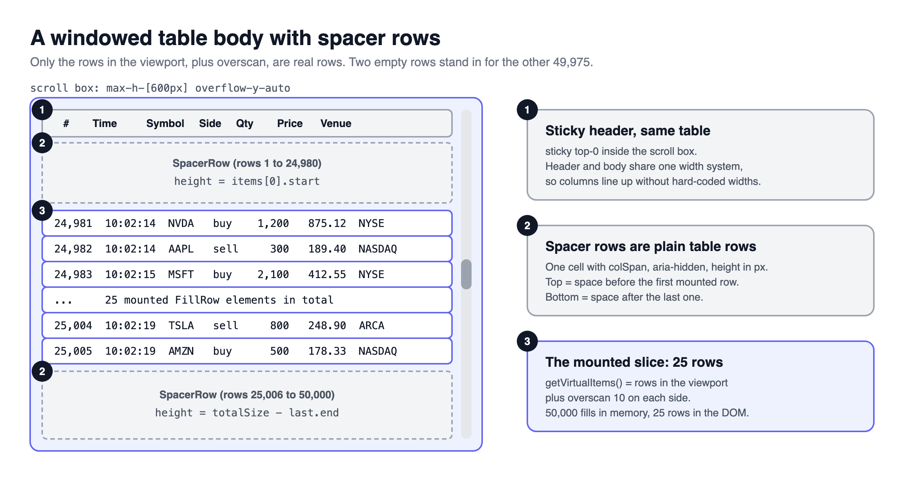
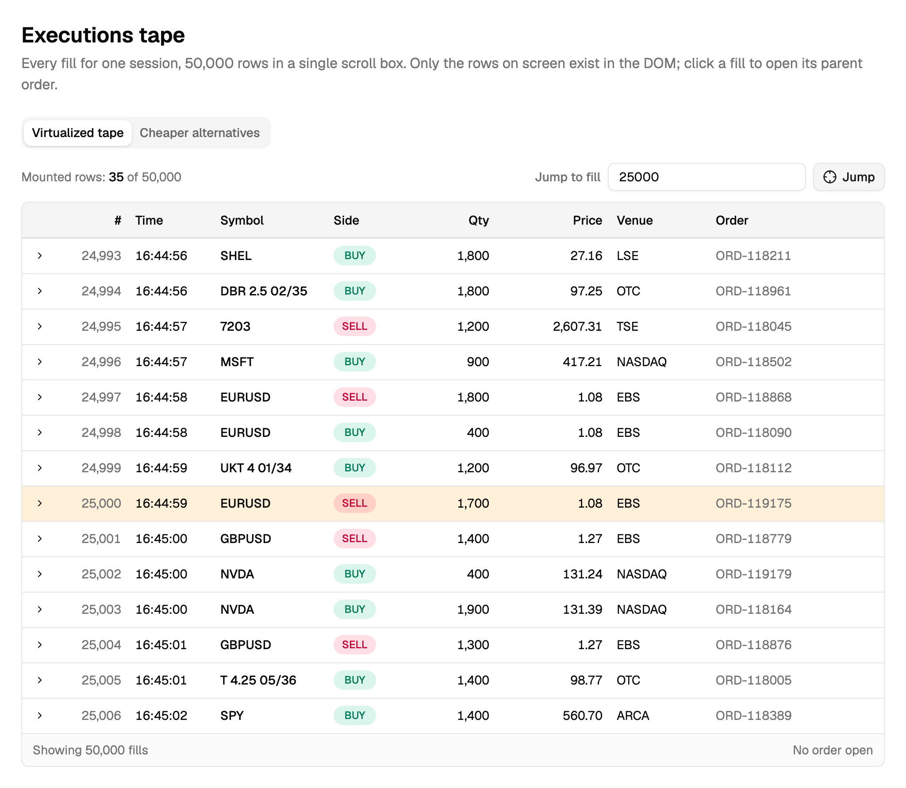
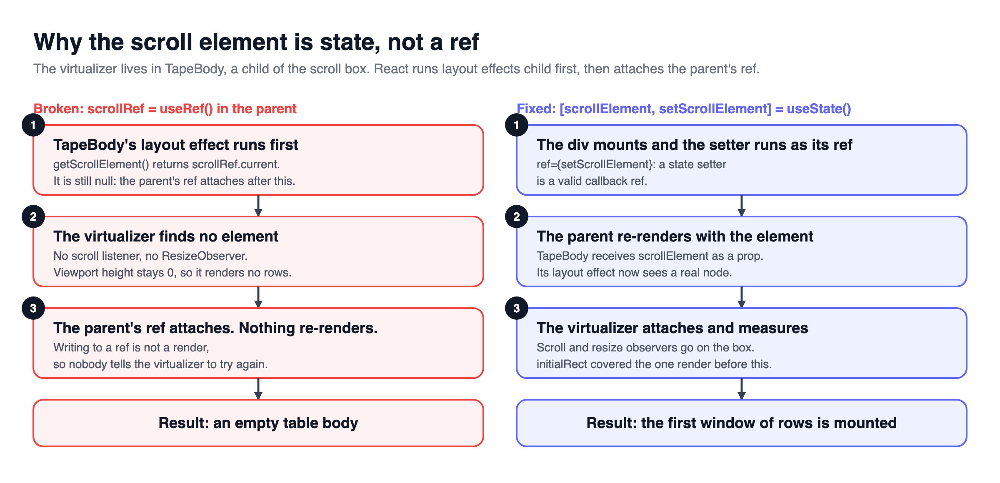
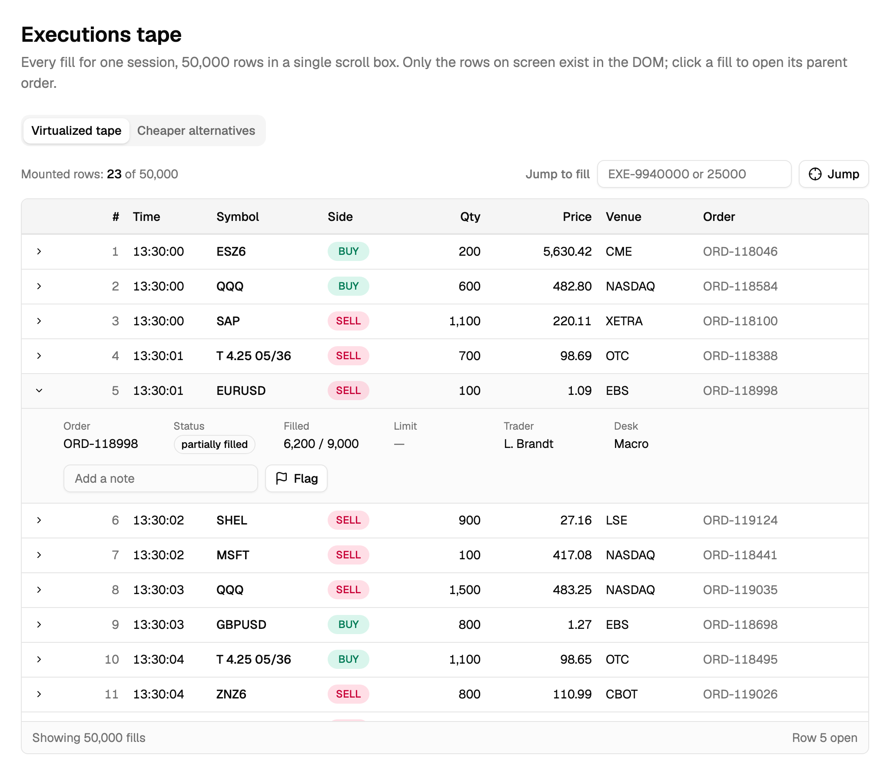
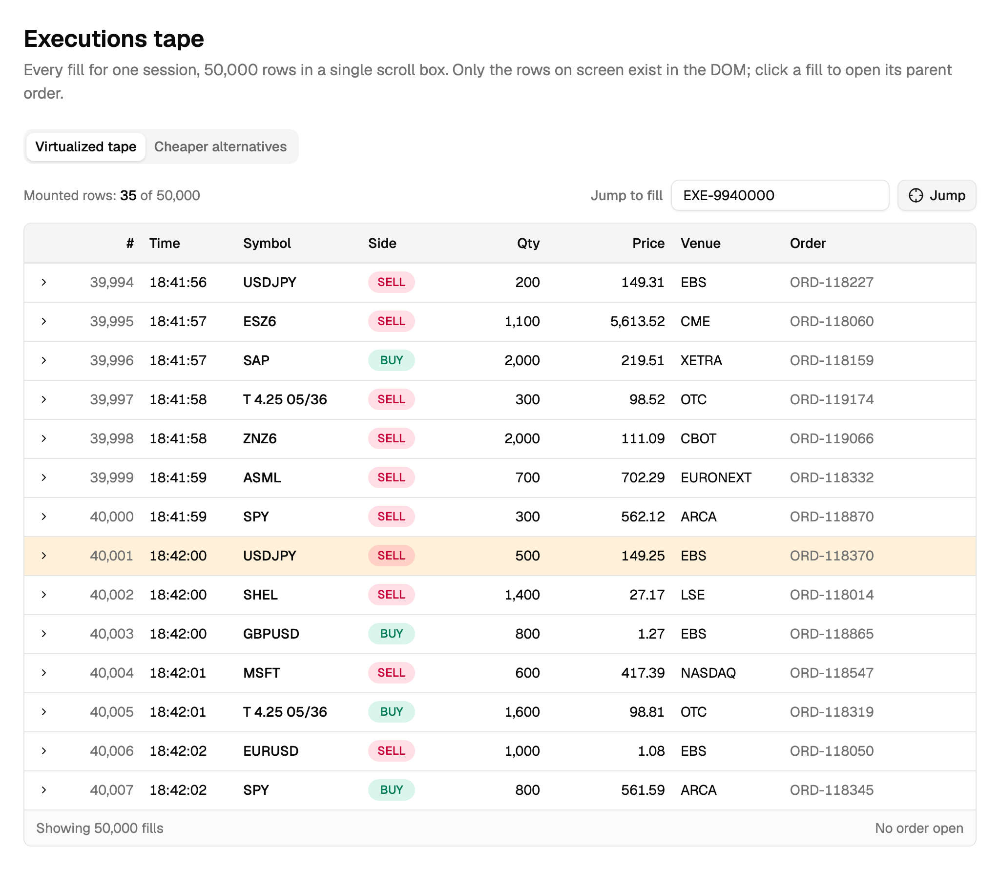
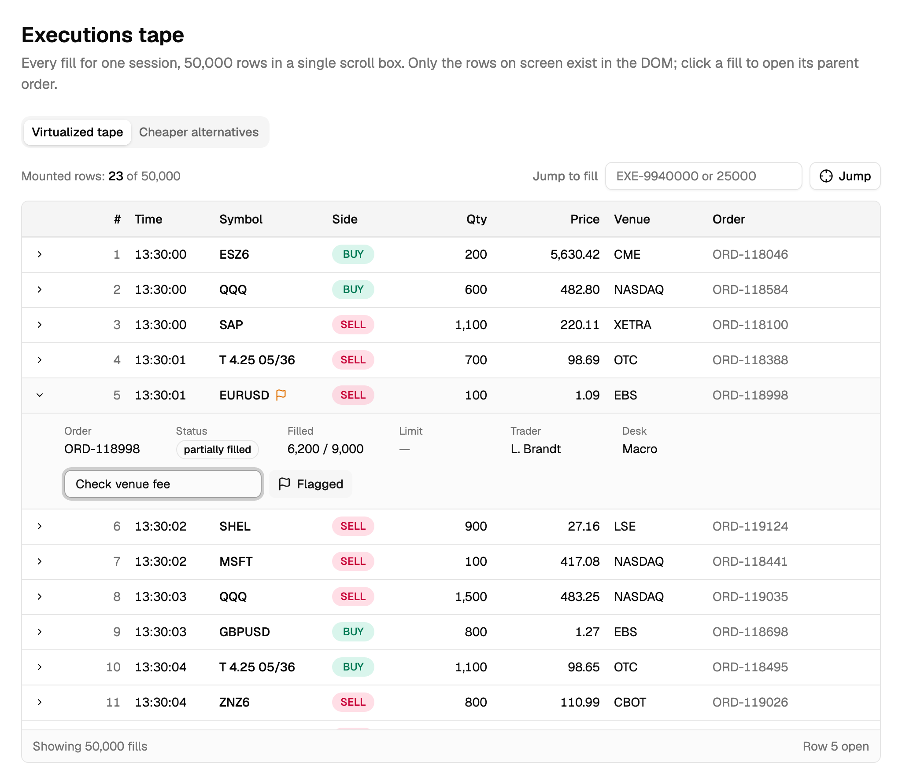

> [!TERMS]
>
> - **DOM** - the live tree of elements the browser keeps for your page. Every `<tr>` is a node in it.
> - **Mounted** - actually present in the DOM right now.
> - **Virtualization (windowing)** - only mounting the rows you can currently see, and faking the rest with empty space.
> - **Spacer row** - an empty row as tall as all the rows it stands in for.
> - **Overscan** - a few extra rows mounted just outside the visible area, so fast scrolling does not show blanks.
> - **Ref** - React's way to hold a direct handle to a DOM element.
> - **Layout effect** - code React runs right after changing the DOM, before the screen is painted.
> - **Memo** - telling React to skip re-drawing a component when its inputs have not changed.
> - **jsdom** - a fake browser used in tests. It has a DOM but does no layout, so every size is 0.

[Part 13](#/docs/virtualization-measure-first) showed how to measure a slow table and why paging or a Show more cap usually wins; this part is for the case where neither is enough.

## The big picture

> [!TLDR]
> Mount only the rows in view, stand in for the rest with two spacer rows, and keep everything the rows need in the parent.

> [!ANALOGY]
> Virtualization is a train window.
> The landscape is miles long, but you only ever see one window's worth, and the scenery outside it does not need to exist until you reach it.

Table: each row is a piece this doc adds, and the problem it solves.

| Piece                            | Problem it solves                                        |
| -------------------------------- | -------------------------------------------------------- |
| Two spacer rows                  | The table keeps its real height and scrollbar            |
| Scroll box held in state         | The virtualizer's own effect can run before a ref is set |
| Measured row heights             | Rows are not all the same height                         |
| Memoized rows, tested with shims | Re-renders and jsdom both need real fixes                |

> [!RECAP]
>
> - Spacer rows, state instead of a ref, measured heights, and memoized rows are four separate fixes for four separate problems.
> - Each of the next four sections covers one.

## Two spacer rows

> [!TLDR]
> Mount only the visible rows, and put one empty "spacer" row above them and one below them, each as tall as the rows it stands in for.
> The scrollbar then behaves as if every row were there.



Each virtual item knows where it starts and ends, in pixels.
The gap before the first one and after the last one become the two spacers.

> [!THINK]
> You have the list of visible items, each with a `start` and `end` in pixels, and the total height of all rows.
> How tall is the top spacer? How tall is the bottom one?

```tsx title="tape-body.tsx"
const items = virtualizer.getVirtualItems(); // the rows in view, plus overscan
const total = virtualizer.getTotalSize();

const paddingTop = items.length > 0 ? items[0].start : 0;
const paddingBottom =
  items.length > 0 ? total - items[items.length - 1].end : 0;

// <SpacerRow height={paddingTop} />
// {items.map((item) => <FillRow key={item.key} fill={fills[item.index]} />)}
// <SpacerRow height={paddingBottom} />
```

> [!STEPS]
>
> 1. **Let the outer box do the scrolling.** shadcn's table wraps itself in its own scrolling box, which would trap the sticky header; switch that inner scroll off.
> 2. **Key each measurement by the row's id**, not its position, so inserting a row does not give it the wrong height.
> 3. **Hide spacers from screen readers** with `aria-hidden`.



> [!NUANCE]-
>
> - The library's docs position each row absolutely. That suits card lists and chat logs.
>   In a table, an absolutely positioned row leaves the table's layout, so its cells stop lining up with the header.
> - Work out the visible window straight from the scroll position. Tools that report visibility _later_ (after the frame) show blank rows during fast scrolls. Blank-but-fast is worse than slow.

> [!RECAP]
>
> - Two spacer rows stand in for everything above and below the visible window.
> - Spacer rows keep the table layout, so body and header columns line up.
> - Compute the window from the scroll position, synchronously.

## The scroll box must be state, not a ref

> [!TLDR]
> If the virtualizer lives in a child component, hand it the scroll box through **state**, not a ref.
> Otherwise the first render shows an empty table.



> [!GOTCHA]
> React finishes children before parents.
> So the child's virtualizer looks for the scroll box _before_ the parent has attached its ref, finds nothing, and gives up.
> Writing to a ref later does not trigger a re-render, so nothing ever tells it to try again.
> The symptom is a header over an empty body.

> [!THINK]
> What kind of value, when it changes, makes React draw again?
> If you pass a function as `ref`, when does React call it?

```tsx title="executions-tape.tsx"
const [scrollElement, setScrollElement] = useState<HTMLDivElement | null>(null);

// <div ref={setScrollElement} className="h-[600px] overflow-y-auto">
//   <TapeBody scrollElement={scrollElement} />

useVirtualizer({
  getScrollElement: () => scrollElement,
  initialRect: { width: 1024, height: 600 }, // a guess, so even the first render shows rows
});
```

Passing the state setter as the ref fixes it.
When the box appears, React calls the setter, the parent re-renders, and the child gets a real element.

> [!INTERVIEW]-
>
> - _Why `initialRect`?_ Until it has measured anything, the virtualizer assumes the box is 0px tall and shows nothing - including in the server-rendered HTML.

> [!RECAP]
>
> - Give a child virtualizer the scroll box through state, not a ref.
> - Pass initialRect so the first render shows rows.

## Rows of different heights, and stopping extra re-draws

> [!TLDR]
> Let the virtualizer measure each row, keep row state in the parent, and compare row inputs field by field so typing in one row redraws one row.

> [!STEPS]
>
> 1. **Measure each row.** Give it `data-index` and `ref={virtualizer.measureElement}`. The size you guess up front is only a starting point.
> 2. **Treat the expanded detail as its own row.** A `<tr>` cannot hold a block underneath its own cells.
> 3. **Keep "which row is open" in the parent.** A row unmounts when it scrolls out of view and would forget it was open.
> 4. **Compare row inputs field by field.** A small object rebuilt for every row on every render looks "new" each time, so plain memo never skips anything.
> 5. **Pass one stable click handler that takes an id.** A fresh `() => toggle(id)` per row also defeats memo.

> [!THINK]
> Each row gets `draft={{ flagged, note }}`, a brand new object every render.
> What would a memo comparison need to check so an unchanged row is skipped?

```tsx title="fill-row.tsx"
export const FillRow = memo(
  FillRowInner,
  (prev, next) =>
    prev.fill === next.fill &&
    prev.open === next.open &&
    prev.draft.flagged === next.draft.flagged &&
    prev.draft.note === next.draft.note &&
    prev.onToggle === next.onToggle,
);
```



> [!NUANCE]-
>
> - Tell the virtualizer about the sticky header (`scrollPaddingEnd`), or "scroll to row" hides the row under it.
> - When no filter is active, return the **same** array rather than a filtered copy, so the virtualizer does not recalculate everything.

> [!RECAP]
>
> - Let the virtualizer measure each row; your size is only a starting guess.
> - Keep open and edited state in the parent.
> - Compare row inputs field by field, and pass one stable handler.

## Finding rows, and testing

> [!TLDR]
> After virtualizing, the 412th fill is no longer the 412th `<tr>`.
> Find rows by a `data-` id, and give the fake test browser a few made-up sizes so it mounts anything at all.

"Jump to fill" scrolls to the index, then looks for the row by id once per frame for a few frames, because it is not in the DOM the instant you ask.
The row needs `tabIndex={-1}` so you can move keyboard focus to it.



> [!THINK]
> jsdom says every element is 0px tall and has no `scrollTo`.
> Which three sizes and which one method must you fake before a virtualizer mounts any rows?

```ts title="setup-virtual.ts"
Object.defineProperty(HTMLElement.prototype, "offsetHeight", {
  configurable: true,
  value: 600,
});
Object.defineProperty(HTMLElement.prototype, "clientHeight", {
  configurable: true,
  value: 600,
});
Object.defineProperty(HTMLElement.prototype, "scrollHeight", {
  configurable: true,
  value: 2_000_000,
});
HTMLElement.prototype.scrollTo = function () {};

// then assert that SOME rows mount and MOST do not:
// expect(rows.length).toBeGreaterThan(0);
// expect(rows.length).toBeLessThan(100);
```

Table: each row is a styling need of a windowed table and why it matters.

| Styling need                         | Why                                                                                                         |
| ------------------------------------ | ----------------------------------------------------------------------------------------------------------- |
| `table-fixed` with set header widths | Otherwise the browser sizes columns from whichever rows happen to be mounted, and they jump while scrolling |
| Sticky styles on each header cell    | Borders and backgrounds do not travel with a sticky row                                                     |
| Fixed-width buy/sell badges          | "buy" and "sell" are different widths and would wobble the column                                           |
| `tabular-nums` on live counters      | Stops the numbers twitching as fills stream in                                                              |

> [!WIN]-
> 50,000 fills, about 35 rows in the DOM at any moment, columns that stay still, and a test that fails if anyone brings the empty-table bug back.



> [!RECAP]
>
> - Find rows by a data- id, never by their position in the DOM.
> - Fake sizes and scrollTo in jsdom, then test that some rows mount and most do not.
> - Use table-fixed so columns do not jump while scrolling.

## Summary

> [!SUMMARY]
>
> - In a table, window with two spacer rows so header and body stay aligned.
> - Hand a child virtualizer the scroll box as state, and give it an initialRect.
> - Rows mount and unmount as you scroll: keep their state in the parent and compare their inputs field by field.
> - Address rows by id, and test in jsdom with faked sizes, asserting that some rows mount and most do not.

```quiz
[
  {
    "q": "A virtualized table uses absolutely positioned rows. What is the typical visible defect?",
    "options": [
      "Rows flicker blank during fast scrolling",
      "The scrollbar height is wrong by one row",
      "Screen readers announce the spacer rows",
      "Body cells stop lining up with the header columns"
    ],
    "answer": 3,
    "expl": "An absolute tr leaves table layout, so cell widths are no longer shared with the header. Spacer rows keep everything in one table."
  },
  {
    "q": "The first render of a virtualized table shows a header and an empty body. The virtualizer is in a child, reading a ref from the parent. Why?",
    "options": [
      "estimateSize returned zero for every row",
      "The scroll element had overflow set to visible",
      "The child effect ran before the ref attached",
      "getItemKey returned duplicate keys for rows"
    ],
    "answer": 2,
    "expl": "Children's layout effects run before the parent's ref is set in the same commit. The virtualizer sees null, and a ref write never re-renders to retry."
  },
  {
    "q": "What makes passing the scroll element as state fix that bug?",
    "options": [
      "State is available before any layout effect runs",
      "The setter as a callback ref triggers a re-render",
      "State avoids the stale closure inside useVirtualizer",
      "Refs cannot be read inside child components"
    ],
    "answer": 1,
    "expl": "React calls setScrollElement(node) when the div mounts, which re-renders the parent and hands the child a real element as a prop. State is not available any earlier than a ref."
  },
  {
    "q": "Why build the virtual window from synchronous scroll math rather than IntersectionObserver?",
    "options": [
      "Observer callbacks arrive late, showing blank rows",
      "IntersectionObserver is unsupported in table elements",
      "Scroll math uses less memory for large lists",
      "IntersectionObserver cannot measure variable heights"
    ],
    "answer": 0,
    "expl": "Observer callbacks run after the frame, so a fast scroll paints a stale, blank window. Blank-but-fast is worse than slow."
  },
  {
    "q": "A user expands a fill, scrolls far away, scrolls back, and the fill is collapsed again. What is the fix?",
    "options": [
      "Increase overscan so the row stays mounted",
      "Lift the expanded id into the parent component",
      "Memoize the row with a field-wise comparator",
      "Use getItemKey so the row keeps its identity"
    ],
    "answer": 1,
    "expl": "A windowed row unmounts when it leaves the window, taking local state with it. More overscan only delays the problem; state that must survive scrolling lives above the virtualizer."
  },
  {
    "q": "Typing in one row's note field re-renders all 35 mounted rows. Each row receives draft={{ flagged, note }}. Which changes fix it? Select all that apply.",
    "options": [
      "A memo comparator that compares draft field by field",
      "Passing one stable toggle handler that takes an id",
      "Raising overscan so fewer rows remount",
      "Moving drafts into a module-level variable"
    ],
    "answer": [
      0,
      1
    ],
    "multi": true,
    "expl": "The rebuilt draft object and any inline handler both defeat memo. Overscan changes how many rows exist, not why they re-render; a module variable leaks and never renders."
  },
  {
    "q": "After calling scrollToIndex, the code immediately querySelects the target row and gets null. What should it do?",
    "options": [
      "Call scrollToIndex a second time synchronously",
      "Wrap the lookup in flushSync to force a render",
      "Increase estimateSize so the row mounts sooner",
      "Retry the lookup each frame, bounded"
    ],
    "answer": 3,
    "expl": "The scroll, the new window and the React commit all happen later. A bounded per-frame retry finds the row once it exists."
  },
  {
    "q": "In vitest with jsdom, a virtualized table mounts zero rows. Which shims are needed? Select all that apply.",
    "options": [
      "offsetHeight and offsetWidth on elements",
      "A polyfill for requestIdleCallback",
      "scrollTo, which jsdom does not implement",
      "A mock for window.matchMedia queries"
    ],
    "answer": [
      0,
      2
    ],
    "multi": true,
    "expl": "jsdom does no layout, so sizes are zero and scrollToIndex has nothing to call. The virtualizer does not read idle callbacks or media queries."
  }
]
```

```related
[
  {
    "title": "TanStack Virtual",
    "url": "https://tanstack.com/virtual/latest/docs/introduction",
    "source": "TanStack Virtual docs",
    "kind": "read",
    "note": "The library behind useVirtualizer, measureElement and scrollToIndex."
  },
  {
    "title": "Virtualization guide",
    "url": "https://tanstack.com/table/v8/docs/guide/virtualization",
    "source": "TanStack Table docs",
    "kind": "read",
    "note": "How TanStack Table pairs with TanStack Virtual."
  },
  {
    "title": "Manipulating the DOM with refs",
    "url": "https://react.dev/learn/manipulating-the-dom-with-refs",
    "source": "React docs",
    "kind": "read",
    "note": "When refs are attached, and why writing to one never re-renders."
  },
  {
    "title": "memo",
    "url": "https://react.dev/reference/react/memo",
    "source": "React docs",
    "kind": "read",
    "note": "Custom comparison functions, used here to stop every row re-drawing."
  },
  {
    "title": "Data Table III",
    "url": "https://www.greatfrontend.com/questions/user-interface/data-table-iii",
    "source": "GreatFrontEnd",
    "kind": "practice",
    "difficulty": "Hard",
    "note": "Build a generic table first - then try windowing it with 10,000 rows."
  }
]
```
